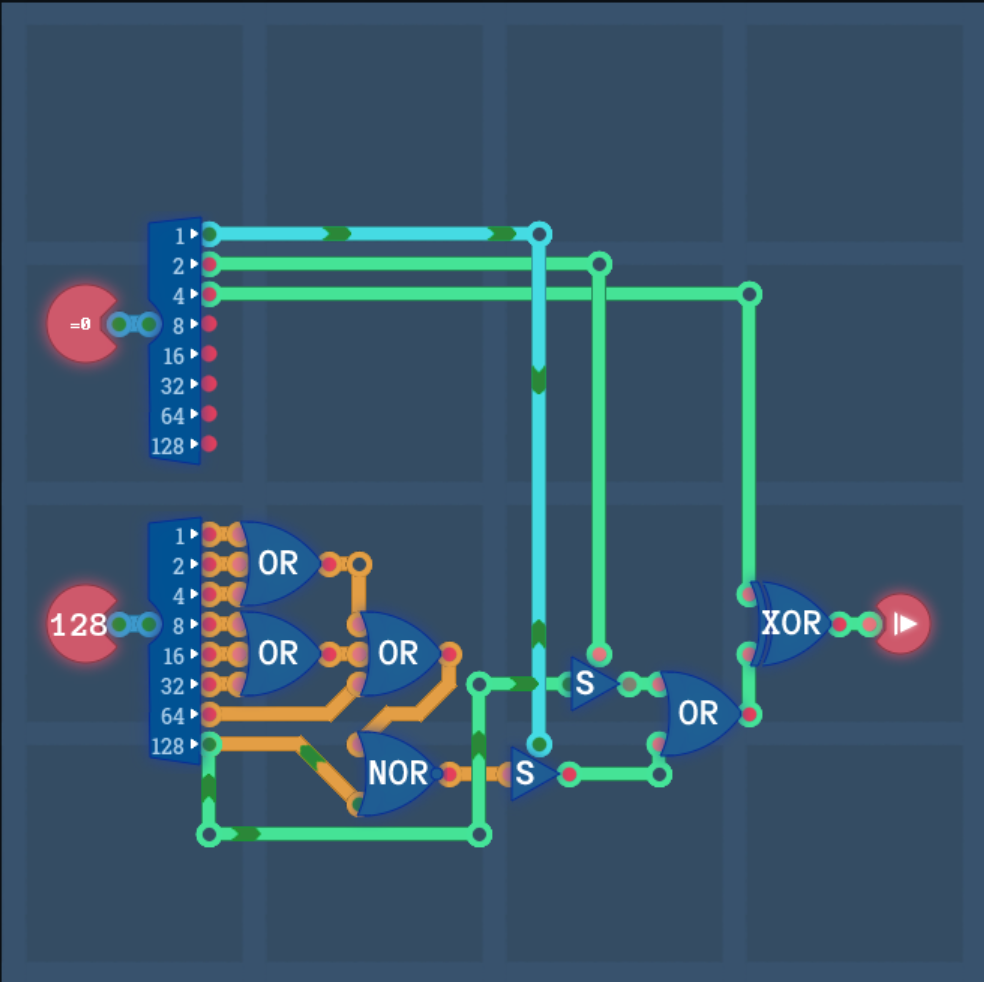

# 图灵完备

!!! note "以防有人不知道"
    2025.06.07：图灵完备全成就！

    下面是我手搓 CPU 时的一些笔记，感觉主要还是备忘录性质，~~不然过一个月连自己当初 opcode 咋设计的都不知道了~~。


## 第三章：处理器架构

### 3-1 算数引擎（Arithmetic Logic Unit，算术逻辑单元 ALU）

目前我们实现的运算分别有：

|  操作码  | 运算 |   含义   |
| :------: | :--: | :------: |
| 00000000 |  OR  |    或    |
| 00000001 | NAND |   与非   |
| 00000010 | NOR  |   或非   |
| 00000011 | AND  |    与    |
| 00000100 | ADD  | 符号数加 |
| 00000101 | SUB  | 符号数减 |

这个操作码的设定很有讲究。我们手头上现有的逻辑门有 8 bit 或门、8 bit 非门，四条逻辑运算分别为：

$$
\begin{matrix}
\text{opcode} & \text{Instruction} & & \text{Equivalence}\\
00000000 & A\lor B & \iff & A\lor B\\
00000001 & \overline{A\land B} & \iff & \overline{A}\lor \overline{B}\\
00000010 & \overline{A\lor B} & \iff & \overline{A\lor B}\\
00000011 & A\land B & \iff & \overline{\overline{A}\lor \overline{B}}
\end{matrix}
$$

根据 opcode 的最低位确定是否要将 A、B 取非，然后或起来，再根据 opcode 的次低位决定是否要取非。

而 opcode 的第 $2$ 位可以判断是逻辑运算还是算术运算，据此分辨开来。


### 3-2 寄存器之间（Register File，寄存器组 RF）

> 这里我们需要设计寄存器间的数据传输指令系统，支持将 8 bit 数据从源寄存器传到目标寄存器。

我们搭建了 $6$ 个 8 bit 寄存器，形成了寄存器组。其指令格式如下：

```assembly
mov dst, src 
```

其中 src 是源寄存器地址（3 bit），dst 是目标寄存器地址（3 bit）。地址信息如下：

- $0\le \text{src}\le 5$，输入来自 $\text{reg[src]}$；
- $\text{src}=6$，输入来自输入组件；
- 其余未定义。

这一部分设计比较简单，仔细设定寄存器的使能输入/输出信号即可。

### 3-3 指令解码器（Instruction Decoder，指令解码器 ID）

> 将输入的 8 bit 指令解码出四种不同的控制状态。

目前指令 Instruction 的高 $2$ 位是状态信号，具体如下：

$$
\begin{matrix}
\text{opcode} & \text{meaning}\\
\text{00xxxxxx} & \text{immediate}\\
\text{01xxxxxx} & \text{calculation}\\
\text{10xxxxxx} & \text{copy}\\
\text{11xxxxxx} & \text{condition}
\end{matrix}
$$

这一部分设计也很简单。

### 3-4 条件判断（condition）

```asm
cmp reg1, reg2  
cmp decoded from opcode
if cmp = true, jump to reg0
```

这一部分查表，直接暴力判断即可。先用 3-8 Decoder，然后设 $8$ 个开关，将输出连在一起即可。


对于成就十项条“件”，同样关注到 opcode 的设定很有讲究，具体而言：

- 最低位，判断是否 $=0$；
- 次低位，判断是否 $<0$，即 num 的最高位；
- 最高位，判断是否将结果取反，即 xor。

设计的电路如下：



### 3-5 立即数（immediate）

其指令格式如下：

```assembly
mov reg0, imm  
```

将输入传输到 $\text{reg[0]}$ 即可。

### 3-6 图灵完备 & 计算单元（Turing Complete & Computation Unit，计算单元 CU）

把上述写好的所有东西串起来即可。

程序的这一部分，我们使用之前写好的计数器模块（相当于 PC），PC 的具体跳转方式如下：

- 如果无写入信号，则 PC 自然 +1（PC 以字节计）；
- 如果有写入信号，则 PC 跳转到数值为 $\text{reg0}$ 的地址。

算术模块如下：

- 要判断的两个数位于 $\text{reg1},\text{reg2}$；
- 判断的结果放置到 $\text{reg3}$。

立即数模块如下：

- 将输入信号放置到 $\text{reg0}$。

条件判断模块如下：

- 如果 $\text{reg3}$ 满足条件，那么计数器模块的写入信号置为 $1$，并且写入数值为 $\text{reg0}$。

## 第四章：编程

### 密码锁

```assembly
1
mov_r2_r0 # r2 = 1
label again
sub
mov_r1_r3
mov_out_r3
mov_r3_in
again
jp
```

### 迷宫

略。

## 第五章：处理器架构 2

现在一条指令变成了 4 字节（32 bit），第一个字节是 opcode，即操作码，指代如下：

|  操作码  |  运算  |   含义   |
| :------: | :----: | :------: |
| xx000000 |  ADD   |    加    |
| xx000001 |  SUB   |    减    |
| xx000010 |  AND   |    与    |
| xx000011 |   OR   |    或    |
| xx000100 |  NOT   |    非    |
| xx000101 |  XOR   |   异或   |
| xx000110 |  SHL   | 逻辑左移 |
| xx000111 |  SHR   | 逻辑右移 |
| xx100000 |  $=$   |          |
| xx100001 | $\neq$ |          |
| xx100010 |  $<$   |          |
| xx100011 | $\le$  |          |
| xx100100 |  $>$   |          |
| xx100101 | $\ge$  |          |

操作码的第 $7$ 位为 1 则表示 rs1 为立即数，直接读取第二个字节（8 bit）作为立即数。

操作码的第 $6$ 位为 1 则表示 rs2 为立即数。

操作码的第 $5$ 位为 1 则表示 rs1 和 rs2 进入 condtional 模块（即 RISC-V 中的 branch，b-type 类型），并且第一个字节的信息是用于比大小的；操作码的第 $5$ 位为 0 则表示 rs1 和 rs2 进入 ALU 模块。

第二个字节指代 rs1，第三个字节指代 rs2，第四个字节指代 rd。字节的信息指代如下：

|   byte   | meaning |
| :------: | :-----: |
| 00000000 |  reg0   |
| 00000001 |  reg1   |
| 00000010 |  reg2   |
| 00000011 |  reg3   |
| 00000100 |  reg4   |
| 00000101 |  reg5   |
| 00000110 |   pc    |
| 00000111 |  I / O  |
| 00001000 | reg_ram |
| 00001001 |   ram   |
