# 圆锥曲线出题背景探究

!!! warning "温馨提醒"
    本文写于 2023.07.23（不确定，待商榷），并同步投稿于个人公众号。

    近期在整理时有细微调整。

|  #   |         联考         |     类型     |     个人认为最优解法     | 推广性 | 难度 |
| :--: | :------------------: | :----------: | :----------------------: | :----: | :--: |
|  1   |   2023.02 Z20 联盟   | 双曲线，定值 |   极点极线，自极三角形   | 易推广 |  水  |
|  2   |   2023.02 四省联考   | 双曲线，定值 |    极点极线，调和点列    | 易推广 |  水  |
|  3   |  2023.02 杭州市统测  |  椭圆，定点  |   极点极线，自极三角形   | 易推广 |  水  |
|  4   |  2023.02 名校协作体  |  椭圆，定值  |  相似三角形，角度焦点弦  | 易推广 |  易  |
|  5   |   2023.02 湖州调研   |  椭圆，定值  |           对合           | 易推广 |  易  |
|  6   |   2023.02 温州期末   |  椭圆，定点  | 四点共圆，光学，极点极线 | 易推广 |  中  |
|  7   |   2023.02 浙南七彩   | 双曲线，定点 |      第三定义，相似      |   /    |  易  |
|  8   |   2023.02 浙江十校   | 双曲线，定值 |    极点极线，调和点列    | 易推广 |  水  |
|  9   |   2023.03 强基联盟   | 双曲线，定点 |   极点极线，自极三角形   | 易推广 |  水  |
|  *   |   2023.03 湖南九校   |  椭圆，定点  |           对合           | 易推广 |  水  |
|  *   |  2023.03 浙里卷天下  | 双曲线，定点 |           对合           | 易推广 |  水  |
|  10  |   2023.03 杭二月考   | 抛物线，定值 |           向量           |   /    |  中  |
|  *   |   2023.03 淄博一模   | 抛物线，定线 |   极点极线，自极三角形   | 易推广 |  水  |
|  *   |   2023.03 汕头一模   | 抛物线，定点 |           对合           | 易推广 |  水  |
|  *   |   2023.03 莆田二检   | 双曲线，定线 |    极点极线，调和点列    | 易推广 |  水  |
|  *   |   2023.03 漳州三检   | 抛物线，定点 |           对合           | 易推广 |  水  |
|  *   |   2023.03 广州一模   | 抛物线，定值 |        几何，对合        | 易推广 |  水  |
|  11  |   2023.04 武汉四调   | 双曲线，定点 |    极点极线，调和线束    | 难推广 |  中  |
|  12  | 2023.04 长沙一中月考 |     椭圆     |    阿氏圆，角度焦点弦    |   /    |  中  |

**说明**

- 本文**几乎所有题踩标**，而标答全是繁琐、冗长、枯燥的爆算。
- 推广性：默认圆锥曲线本身不变，我们着眼于题干中的特定点以及直线，分析它的"特殊身份"，并从中寻出题契机，思考满足什么条件的特定点、直线有这些性质。
- 难度：分为水、易、中、难。这是基于几何难度评估的，与解析几何做法的计算量大小无关。
- 本文目的是**透过现象看本质**，回归几何本身，寻原始美。做法本身都是正确的，但是在高考大背景下很多几何性质都不能直接用。
- 从 3 月份开始，笔者开始面向全国优质联考卷，并只记录难度 >= 易的题。

## 理论基础

### 切线

设 $\mathrm{C}:ax^2+by^2=1$，点 $\mathrm{P}(x_0,y_0)$ 在 $\mathrm{C}$ 上，则 $\mathrm{P}$ 的切线为 $\mathrm{l}:ax_0x+by_0y=1$。

**法一 (隐函数，简洁，可能会扣分)** 将 $y$ 视作关于 $x$ 的函数，则 $2ax+2byy'=0$，故 $y'=-\frac{ax}{by}$。

**法二 (均值，适用椭圆)** 不妨 $a,b>0$。若 $\mathrm{l}$ 过椭圆上另一点 $\mathrm{Q}(x_1,y_1)$，由 $\sqrt{ab}\le \sqrt{\frac{a^2+b^2}{2}}$，

$$
ax_0x+by_0y\le \frac{a(x_0^2+x^2)+b(y_0^2+y^2)}{2}=\frac{1+ax^2+by^2}{2}
$$

代入 $\mathrm{Q}$ 得 $ax_0x+by_0y\le 1$，在 $x=x_0,y=y_0$ 时取等，与 $(x_1,y_1)$ 矛盾，因此 $\mathrm{l}$ 只过 $\mathrm{P}$ 点。

**法三 (联立韦达)** 圆锥曲线的切线不会有第二个交点，所以可以联立后判别式为零。但一般曲线不适用。

### 光学性质

设椭圆 $\frac{x^2}{a^2}+\frac{y^2}{b^2}=1$，焦点为 $\mathrm{F_1,F_2}$，点 $\mathrm{P}$ 在椭圆上，则椭圆在点 $\mathrm{P}$ 处的切线是 $\angle \mathrm{F_1PF_2}$ 的外角平分线。

**证明** 设切线为 $l$，$\mathrm{F_1}$ 关于 $l$ 的对称点为 $\mathrm{F_1'}$。

对于切线 $l$ 上任意一点 $\mathrm{Q}$，有 $|\mathrm{QF_1'}|=|\mathrm{QF_1}|$（对称性），因此

$$
|\mathrm{QF_1}|+|\mathrm{QF_2}|=|\mathrm{QF_1'}|+|\mathrm{QF_2}|\ge |\mathrm{F_1'F_2}|
$$

当且仅当 $\mathrm{F_1',Q,F_2}$ 三点共线时等号成立。

在点 $\mathrm{P}$ 处，由于 $\mathrm{P}$ 在椭圆上，有

$$
|\mathrm{PF_1}|+|\mathrm{PF_2}|=2a
$$

若 $l$ 不是 $\angle \mathrm{F_1PF_2}$ 的外角平分线，则存在 $l$ 上的点 $\mathrm{Q}\neq \mathrm{P}$ 使得 $|\mathrm{QF_1}|+|\mathrm{QF_2}|<|\mathrm{PF_1}|+|\mathrm{PF_2}|=2a$，即 $\mathrm{Q}$ 在椭圆内部，与 $l$ 是切线矛盾。

因此 $l$ 是 $\angle \mathrm{F_1PF_2}$ 的外角平分线。双曲线同理。

### 极点极线上的调和点列性质

圆锥曲线 $\mathrm{C}:\frac{x^2}{a^2}+\frac{y^2}{b^2}=1$，过点 $\mathrm{P}$ 作直线 $l$ 交 $\mathrm{C}$ 于 $\mathrm{A,B}$ 两点，设直线 $l$ 上一点 $\mathrm{Q}$，则：

- $\mathrm{(P,Q;A,B)}$ 调和与 $\mathrm{Q}$ 在 $\mathrm{P}$ 的极线上等价。

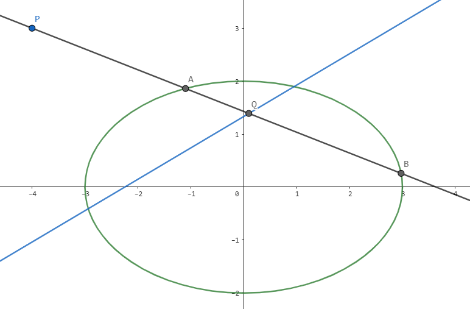

以椭圆为例，不妨只考虑前证后（后证前把过程倒过来就行了）。

**法一 (定比点差)** 设 $\mathrm{A}(x_1,y_1),\mathrm{B}(x_2,y_2)$，设 $\mathrm{\vec{AP}=\lambda\vec{PB}}$，则 $\mathrm{\vec{AQ}=-\lambda\vec{QB}}$。

由定比分点知 $\mathrm{P}(\frac{x_1+\lambda x_2}{1+\lambda},\frac{y_1+\lambda y_2}{1+\lambda})$，$\mathrm{Q}(\frac{x_1-\lambda x_2}{1-\lambda},\frac{y_1-\lambda y_2}{1-\lambda})$。由于 $\mathrm{A,B}$ 都在圆上，故：

$$
\begin{aligned}
&&\left(\frac{x_1^2}{a^2}+\frac{y_1^2}{b^2}\right)-\lambda^2\left(\frac{x_2^2}{a^2}+\frac{y_2^2}{b^2}\right)&=1-\lambda^2 \\
&\Rightarrow&\frac{x_1^2-\lambda^2 x_2^2}{a^2}+\frac{y_1^2-\lambda^2y_2^2}{b^2}&=1-\lambda^2\\
&\Rightarrow &\frac{x_Px_Q}{a^2}+\frac{y_Py_Q}{b^2}&=1
\end{aligned}
$$

因此 $\mathrm{Q}$ 在 $\frac{x_Px}{a^2}+\frac{y_Py}{b^2}=1$ 上。

### 极点极线，自极三角形

设椭圆内接四边形为 $\mathrm{ABCD}$，$\mathrm{P}$ 是 $\mathrm{AB}$ 与 $\mathrm{CD}$ 的交点，$\mathrm{Q}$ 是 $\mathrm{AC}$ 与 $\mathrm{BD}$ 的交点，则 $\mathrm{Q}$ 在 $\mathrm{P}$ 的极线上。

**证明（调和点列）** 在 $\mathrm{AB}$ 上，由极点极线知 $\mathrm{(P,Q_1;A,B)}$ 调和，其中 $\mathrm{Q_1}$ 是 $\mathrm{PQ}$ 与 $\mathrm{AB}$ 的交点。

同理在 $\mathrm{CD}$ 上，$\mathrm{(P,Q_2;C,D)}$ 调和，其中 $\mathrm{Q_2}$ 是 $\mathrm{PQ}$ 与 $\mathrm{CD}$ 的交点。

由于直线 $\mathrm{PQ}$ 唯一，故 $\mathrm{Q_1=Q_2=Q}$，因此 $\mathrm{Q}$ 在 $\mathrm{P}$ 的极线上。

---

## 真题解析

### 1. 2023.02，Z20 联盟，解答第 21 题（有删改）

!!! problem "题目"
    已知双曲线 $\mathrm{E}$ 的顶点为 $\mathrm{A}(-1,0)$，$\mathrm B(1,0)$，方程为 $x^2-\frac{y^2}{2}=1$。点 $\mathrm{P}$ 为 $x$ 正半轴上异于点 $\mathrm{B}$ 的任意点，过点 $\mathrm{P}$ 的直线 $l$ 交双曲线于 $\mathrm{C,D}$ 两点，直线 $\mathrm{AC}$ 与直线 $\mathrm{BD}$ 交于点 $\mathrm{H}$。
    
    **第 2 问** 求证：$\vec{OP}\cdot \vec{OH}$ 为定值。
    
    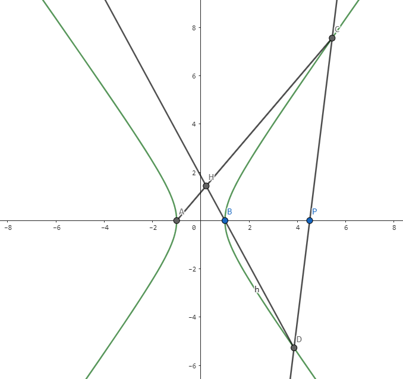

**个人解答** 观察四边形 $\mathrm{ABCD}$，$\mathrm{H}$ 为对角线交点，$\mathrm{P}$ 为对边交点，故 $\mathrm{H}$ 在 $\mathrm{P}$ 的极线上。

设 $\mathrm{P}(x_0,0)$，则 $\mathrm{H}$ 在 $x_0x=1$ 上，故 $x_H=\frac{1}{x_0}$。$\vec{OP}\cdot \vec{OH}=x_P\cdot x_H=1$。

### 2. 2023.02，四省联考，解答第 21 题（有删改）

!!! problem "题目"
    已知双曲线 $\mathrm{C}:\frac{x^2}{16}-\frac{y^2}{9}=1$，点 $\mathrm{A}(4\sqrt{2},3)$，$\mathrm{B}(4\sqrt{2},-3)$，$\mathrm{D}(2\sqrt{2},0)$，$\mathrm{E}$ 为线段 $\mathrm{AB}$ 上一点，且直线 $\mathrm{DE}$ 交 $\mathrm{C}$ 于 $\mathrm{G,H}$ 两点。
    
    **第 2 问** 证明：$\frac{\mathrm{|GD|}}{\mathrm{|GE|}}=\frac{\mathrm{|HD|}}{\mathrm{|HE|}}$。
    
    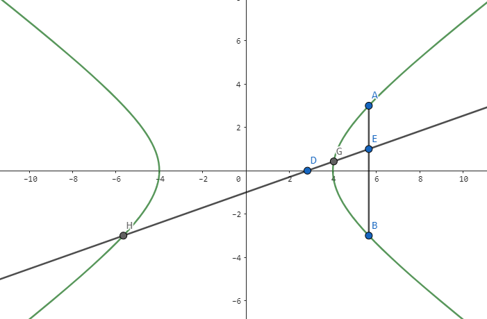

**个人解答** 原式等价于证 $\mathrm{(H,G;D,E)}$ 为调和点列。

设过 $\mathrm{D}$ 的直线为 $l$，则 $l$ 与双曲线交于 $\mathrm{H,G}$。$\mathrm{D}$ 的极线 $x=4\sqrt{2}$，恰好是 $\mathrm{AB}$，与 $l$ 交于 $\mathrm{E}$。

由极点极线知 $(H,G;D,E)$ 为调和点列。

**出题** 只需要让 $\mathrm{AB}$ 是 $\mathrm{D}$ 的极线即可。

### 3. 2023.02，杭州市统测， 解答第 21 题（有删改）

!!! problem "题目"
    已知椭圆 $\mathrm{C}:\frac{x^2}{4}+y^2=1$，上顶点 $\mathrm{M}$，下顶点 $\mathrm{N}$。设点 $\mathrm{T}(t,2)\ (t\neq 0)$，过点 $\mathrm{T}$ 的直线 $\mathrm{TM,TN}$ 分别交椭圆 $\mathrm{C}$ 于点 $\mathrm{E}$ 和点 $\mathrm{F}$。
    
    **第 2 问** 求证：直线 $\mathrm{EF}$ 恒过定点，并求出该定点。
    
    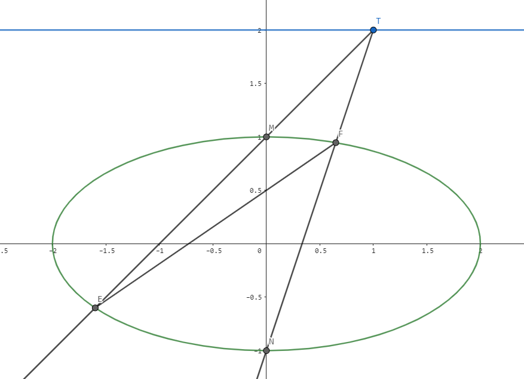

**个人解答** 设 $\mathrm{EF}$ 和 $\mathrm{MN}$ 交于 $\mathrm{P}$。

观察四边形 $\mathrm{ENFM}$，$\mathrm{T}$ 为对边交点，$\mathrm{P}$ 为对角线交点，故 $\mathrm{P}$ 在 $\mathrm{T}$ 的极线上，即 $\frac{tx}{4}+2y=1$。

而 $x_P=0$，故 $\mathrm{P}(0,\frac{1}{2})$。因此直线 $\mathrm{EF}$ 过 $(0,\frac 12)$。

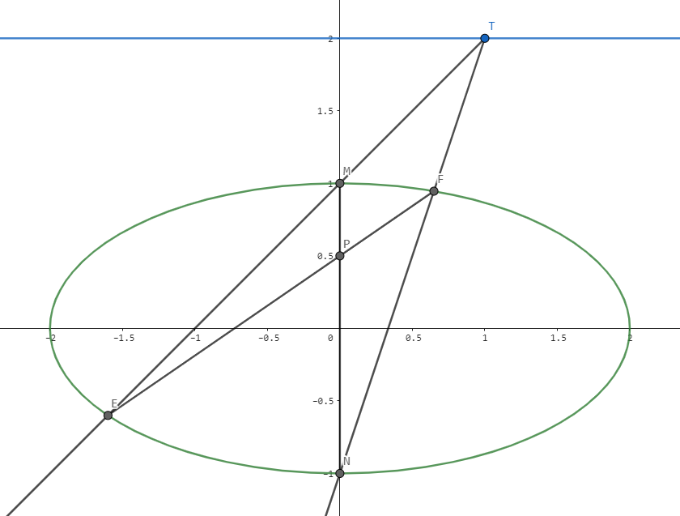

### 4. 2023.02，名校协作体，解答第 22 题（有删改）

!!! problem "题目"
    已知椭圆 $\mathrm{C}:\frac{x^2}{4}+\frac{y^2}{3}=1$，$\mathrm{F_1,F_2}$ 为椭圆 $\mathrm{C}$ 的左右焦点，$\mathrm{Q}(x_0,y_0)$ 为平面的一个动点，其中 $y_0>0$。记直线 $\mathrm{QF_1}$ 与椭圆 $\mathrm{C}$ 在 $x$ 轴上方的交点为 $\mathrm{A}(x_1,y_1)$，直线 $\mathrm{QF_2}$ 与椭圆 $\mathrm{C}$ 在 $x$ 轴上方的交点为 $\mathrm{B}(x_2,y_2)$。
    
    **第 1 问** 若 $\mathrm{AF_2}∥\mathrm{BF_1}$，证明：$\frac{1}{y_0}=\frac{1}{y_1}+\frac{1}{y_2}$；
    
    **第 2 问** 若 $\mathrm{|QF_1|}+\mathrm{|QF_2|}=3$，探究 $y_0,y_1,y_2$ 之间的关系。
    
    

**个人解答**

① 由 $\mathrm{AF_2}∥\mathrm{BF_1}$ 知 $\triangle \mathrm{BQF_1}∽\triangle \mathrm{F_2QA}$，因此 $\mathrm{\frac{|QF_1|}{|QA|}=\frac{|BF_1|}{|AF_2|}}$。

于是 $\frac{y_0}{y_1-y_0}=\frac{y_2}{y_1}$，即 $\frac{1}{y_0}=\frac{1}{y_1}+\frac{1}{y_2}$。

② 显然 $\mathrm{Q}$ 在 $\frac{x^2}{\frac{9}{4}}+\frac{y^2}{\frac{5}{4}}=1$ 上，两椭圆共焦点，用角度焦半径。设 $\angle \mathrm{AF_1F_2}=\alpha,\angle \mathrm{BF_2F_1}=\theta$，则

$$
\begin{cases}
|QF_1|= \frac{\frac 54}{\frac 32-\cos \alpha}\\
|AF_1|= \frac{3}{2-\cos \alpha}\\ 
|QF_2|= \frac{\frac 54}{\frac 32-\cos \theta}\\ 
|BF_2|= \frac{3}{2-\cos \theta}\\
\end{cases}
$$

由于 $|QF_1|+|QF_2|=3$，故

$$
\begin{aligned}
\frac{y_0}{y_1}+\frac{y_0}{y_2}&=\frac{|QF_1|}{|AF_1|}+\frac{|QF_2|}{|BF_2|}\\
&=\frac{5}{12}\left(\frac{2-\cos \alpha}{\frac 32-\cos \alpha}+\frac{2-\cos \theta}{\frac 32-\cos \theta}\right) \\
&=\frac{5}{12}\left(2+\frac{\frac 12}{\frac 32-\cos \alpha}+\frac{\frac 12}{\frac 32-\cos \theta}\right)\\
&=\frac{5}{12}(2+\frac{6}{5})\\
&=\frac{4}{3}
\end{aligned}
$$

因此 $\frac{1}{y_1}+\frac{1}{y_2}=\frac{4}{3}\cdot \frac{1}{y_0}$。

**出题** 只要是共焦点圆锥曲线，都可以用角度焦半径秒杀。

### 5. 2023.02，湖州调研，解答第 21 题（有删改）

!!! problem "题目"
    $\mathrm{A,B}$ 为椭圆 $\mathrm{C}:\frac{x^2}{4}+y^2=1$ 的左右顶点。已知 $\mathrm{O}$ 为坐标原点，点 $\mathrm{P}(-2,2)$，点 $\mathrm{M}$ 是椭圆 $\mathrm{C}$ 上的点，直线 $\mathrm{PM}$ 交椭圆 $\mathrm{C}$ 于点 $\mathrm{Q}$（$\mathrm{M,Q}$ 不重合），直线 $\mathrm{BQ}$ 与 $\mathrm{OP}$ 交于点 $\mathrm{N}$。
    
    **第 2 问** 求证：直线 $\mathrm{AM,AN}$ 的斜率之积为定值，并求出该定值。
    
    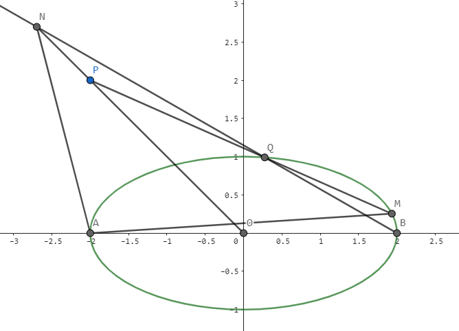

**想法** 显然 $k_{AM}\cdot k_{BM}=-\frac{1}{4}$，而要证的是 $k_{AM}\cdot k_{AN}$ 为定值，因此我们联想到往 $\mathrm{BM}$ 与 $\mathrm{AN}$ 靠拢。

**个人解答** 由 $\frac{1}{k_{AN}}+\frac{1}{k_{BN}}=\frac{2}{k_{NO}}=-2$，而 $k_{BQ},k_{BM}$ 受点 $\mathrm{P}$ 控制，显然可以用齐次化再建立一个倒数和关系。设直线 $\mathrm{PM}$：$m(x-2)+ny=1$，则可得

$$
\left(\frac{1}{4}+m\right)\left(\frac{x-2}{y}\right)^2+n\left(\frac{x-2}{y}\right)+1=0
$$

由于 $\mathrm{PM}$ 过 $(-2,2)$，即 $-4m+2n=1$，因此 $\frac{1}{k_{BQ}}+\frac{1}{k_{BM}}=\frac{-n}{\frac{1}{4}+m}=-2$。

于是我们得到 $k_{AN}=k_{BM}$，故 $k_{AN}\cdot k_{AM}=-\frac{1}{4}$。

**出题** 最后，我们再探究下 $\mathrm{P}(x_0,y_0)$ 满足什么条件时，$k_{AN}\cdot k_{AM}$ 是定值。

上面两个倒数和的式子显然仍为定值，而我们只能让 $k_{AN}=k_{BM}$（否则两定值矛盾）。

- $\frac{1}{k_{AN}}+\frac{1}{k_{BN}}=\frac{2x_0}{y_0}$
- $\frac{1}{k_{BQ}}+\frac{1}{k_{BM}}=\frac{-n}{\frac{1}{4}+m}$，$m(x_0-2)+ny_0=1$

$$
\begin{aligned}
\frac{2x_0}{y_0}&=\frac{-n}{\frac 14+m} \\
(m+\frac 12)x_0&=-2m-1\\
x_0&=-2
\end{aligned}
$$

因此只需满足 $x_P=-2$ 即可。

### 6. 2023.02，温州期末，解答第 21 题

!!! problem "题目"
    椭圆 $\frac{x^2}{4}+y^2=1$ 的左右焦点分别为 $\mathrm{F_1,F_2}$，点 $\mathrm{P}(x_0,y_0)$ 是第一象限内椭圆上的一点，经过三点 $\mathrm{P,F_1,F_2}$ 的圆与 $y$ 轴正半轴交于点 $\mathrm{A}(0,y_1)$，经过点 $\mathrm{B}(3,0)$ 且与 $x$ 轴垂直的直线 $l$ 与直线 $\mathrm{AP}$ 交于点 $\mathrm{Q}$。
    
    **第 1 问** 求证：$y_0y_1=1$；
    
    **第 2 问** 试问：$x$ 轴上是否存在不同于点 $\mathrm{B}$ 的定点 $\mathrm{M}$，满足当直线 $\mathrm{MP,MQ}$ 的斜率存在时，两斜率之积为定值？若存在定点 $\mathrm{M}$，求出点 $\mathrm{M}$ 的坐标及该定值；若不存在，请说明理由。
    
    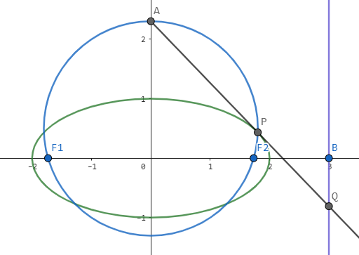

**个人解答**

（1）连接 $\mathrm{AF_1,AF_2,PF_1,PF_2}$。

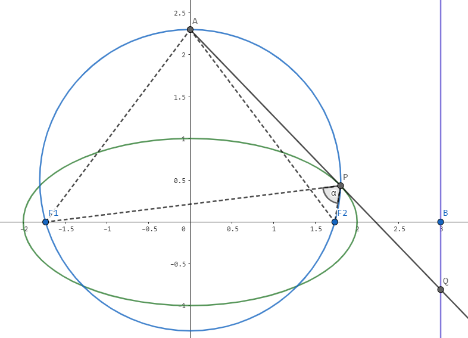

显然 $\mathrm{APF_2F_1}$ 四点共圆，设 $\angle \mathrm{F_1PF_2}=\alpha$，则 $\angle \mathrm{F_1AF_2}=\alpha,\angle \mathrm{AF_2F_1}=90°-\frac{\alpha}{2},\angle \mathrm{APF_1}=90°-\frac \alpha 2$。

由光学性质知 $\mathrm{AP}$ 为点 $\mathrm{P}$ 的切线，因此 $\mathrm{P}$ 在 $\mathrm{A}$ 的极线上。设 $\mathrm{A}(0,y_0)$，则极线为 $y_0y=1$，故 $y_0y_P=1$。

（2）我们已经知道 $\mathrm{PQ}$ 是 $\mathrm{P}$ 的切线了，因此可以把无关信息剥离：

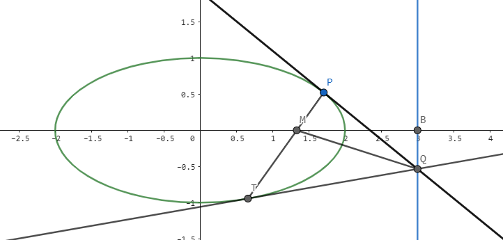

不妨直接讨论**一般情形**，设 $\mathrm{B}(t,0)$，则 $\mathrm{Q}(t,y_Q)$，由于 $\mathrm{PQ}$ 是切线，联想到极点极线。作 $\mathrm{Q}$ 的极线 $\mathrm{PT}$，方程为 $\frac{tx}{4}+y_Qy=1$，因此过点 $\mathrm{M}(\frac{4}{t},0)$。

考虑 $k_{PM}\cdot k_{MQ}=\frac{-t}{4y_Q}\cdot \frac{y_Q}{t-\frac{4}{t}}=-\frac{t^2}{4(t^2-4)}$ 为定值，因此 $\mathrm{M}$ 即为所求定点。

当然我们还要说明**不存在别的 $\mathrm{M}$**。假设存在 $\mathrm{M'}(x_0,0)$，则 $\frac{k_{M'P}\cdot k_{M'Q}}{k_{MP}\cdot k_{MQ}}=1$，由于 $\frac{k_{M'Q}}{k_{MQ}}=\frac{t-\frac{4}{t}}{t-x_0}$ 为定值，因此 $\frac{k_{M'P}}{k_{MP}}=\frac{x_P-\frac{4}{t}}{x_P-x_0}$ 也为定值，故 $x_0=\frac{4}{t}$，重合。

代入本题，$\mathrm{M}(\frac{4}{3},0)$，$k_{PM}\cdot k_{MQ}=-\frac{9}{20}$。

### 7. 2023.02，浙南七彩，解答第 21 题（有删改）

!!! problem "题目"
    已知点 $\mathrm{F}$ 为双曲线 $\mathrm{τ}:\frac{x^2}{4}-\frac{y^2}{12}=1$ 的右焦点，过 $\mathrm{F}$ 的任一直线 $l$ 交 $\mathrm{τ}$ 于 $\mathrm{A,B}$ 两点，直线 $l_1:x=1$。
    
    **第 2 问** 若 $\mathrm{M}(-4,6)$ 为曲线 $\mathrm{τ}$ 上一点，直线 $\mathrm{MA,MB}$ 分别与直线 $l_1$ 交于 $\mathrm{D,E}$ 两点，问以线段 $\mathrm{DE}$ 为直径的圆是否过定点？若是，求出定点坐标；若不是，请说明理由。
    
    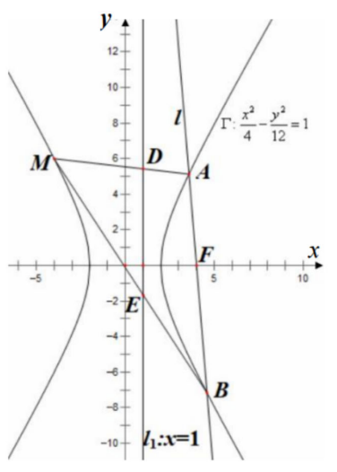

**个人解答** 

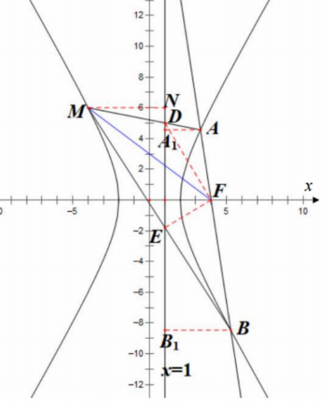

由双曲线第二定义知 $\frac{|AF|}{|AA_1|}=\frac{|MF|}{|MN|}=e$，故 $\frac{|MF|}{|AF|}=\frac{|MN|}{|AA_1|}=\frac{|MD|}{|DA|}$，因此 $\mathrm{FD}$ 平分 $\angle \mathrm{MFA}$。

同理 $\mathrm{FE}$ 平分 $\angle \mathrm{MFB}$，因此 $\angle \mathrm{DFE}=90°$，故 $\mathrm{F}$ 在圆上。

由于圆的对称性，$\mathrm{F}(4,0)$ 的对称点 $(-2,0)$ 也在圆上。

显然定点最多 $2$ 个，因为 $3$ 点直接定圆了。

### 8. 2023.02，浙江十校，解答第 21 题（有删改）

!!! problem "题目"
    设双曲线 $\mathrm{C}:\frac{x^2}{5}-\frac{y^2}{4}=1$ 的右焦点为 $\mathrm{F}(3,0)$。过 $\mathrm{F}$ 的直线交曲线 $\mathrm{C}$ 于 $\mathrm{A,B}$ 两点（其中 $\mathrm{A}$ 在第一象限），交直线 $x=\frac 53$ 于点 $\mathrm{M}$。
    
    **第 2 问** 过 $\mathrm{M}$ 平行于 $\mathrm{OA}$ 的直线分别交直线 $\mathrm{OB}$、$x$ 轴于 $\mathrm{P,Q}$，证明：$\mathrm{|MP|=|PQ|}$。
    
    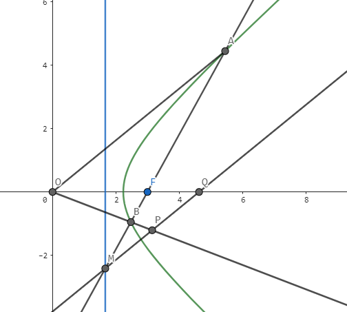

**个人解答** 题目看上去出的很刻意，优先考虑等价变换。因为 $\mathrm{MQ}∥\mathrm{AO}$，因此：

$$
\begin{aligned}
&&\mathrm{|MP|}&=\mathrm{|PQ|}\\
&\iff& 2\mathrm{|MP|}&=\mathrm{|MQ|}\\
&\iff& 2\mathrm{\frac{|BM|}{|BA|}\cdot |AO|}&=\mathrm{\frac{|FM|}{|FA|}\cdot |AO|}\\
&\iff& 2\mathrm{|BM|\cdot |FA|}&=\mathrm{|FM|\cdot |BA|} \\
&\iff& \mathrm{|BM|\cdot |FA|}&=\mathrm{|BF|\cdot |MA|}
\end{aligned}
$$

因此等价于证明 $\mathrm{(F,M;B,A)}$ 为调和点列。设过 $\mathrm{F}$ 的这条直线为 $l$，则 $l$ 与双曲线交于 $\mathrm{A,B}$。由于 $\mathrm{F}$ 的极线是 $x=\frac 53$，故 $l$ 与极线交于 $\mathrm{M}$，因此显然调和。

**出题** 显然任意一个点 $\mathrm{F}$ 以及其极线与 $l$ 的交点 $\mathrm{M}$ 都成立。

### 11. 2023.04，武汉四调，解答第 21 题（有删改）

!!! problem "题目"
    双曲线 $\mathrm{E}:\frac{x^2}{4}-\frac{y^2}{4}=1$，过顶点 $\mathrm{Q}(4,2)$ 的直线 $l$ 与 $\mathrm{E}$ 交于 $\mathrm{M,N}$ 两点。若点 $\mathrm{P}$ 是 $y=x+1$ 上一定点，满足 $k_{\mathrm{PM}}\cdot k_{\mathrm{PN}}$ 为定值，求 $\mathrm{P}$ 的坐标。
    
    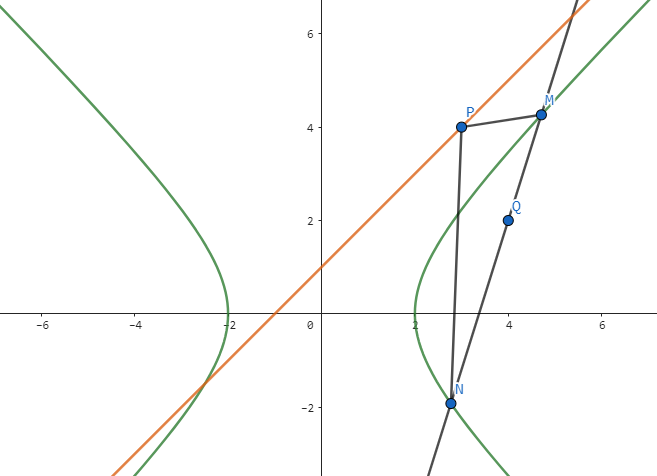

**个人解答**

作 $\mathrm{Q}$ 的极线 $y=2x-2$，交 $y=x+1$ 于点 $\mathrm{P}(3,4)$，交 $\mathrm{MN}$ 于点 $\mathrm{A}$。

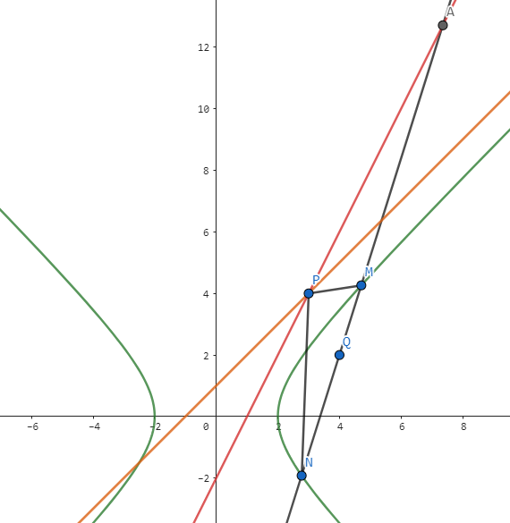

则由极点极线知 $\mathrm{(Q,A;M,N)}$ 为调和点列，因此 $\mathrm{(PQ,PA;PM,PN)}$ 为调和线束。

于是

$$
\begin{aligned}
&&\frac{(k_{PQ}-k_{PM})(k_{PA}-k_{PN})}{(k_{PM}-k_{PA})(k_{PQ}-k_{PN})}&=1 \\
&\Rightarrow &k_{PM}k_{PN}&=4
\end{aligned}
$$

**参考资料**

- [知乎，武汉四调圆锥曲线的斜率积定值问题的一般结论是什么？](https://www.zhihu.com/question/597036976/answer/2997851430)

### 12. 2023.04，长沙一中月考，解答第 22 题（有删改）

!!! problem "题目"
    设椭圆 $\mathrm{C}: \frac{x^2}{8}+\frac{y^2}{6}=1$，焦点为 $\mathrm{F_1,F_2}$，过 $\mathrm{F_2}$ 作斜率为 $k\ (k>0)$ 的直线 $m$ 与椭圆 $\mathrm{C}$ 相交于 $\mathrm{A,B}$ 两点（点 $\mathrm{A}$ 在 $x$ 轴上方）。点 $\mathrm{M,N}$ 是椭圆上异于 $\mathrm{A,B}$ 的两点，$\mathrm{MF_2,NF_2}$ 分别平分 $\angle \mathrm{AMB},\angle \mathrm{ANB}$，若 $\triangle\mathrm{MF_2N}$ 外接圆的面积为 $\frac{81}{8}\pi$，求直线 $m$ 的方程。
    
    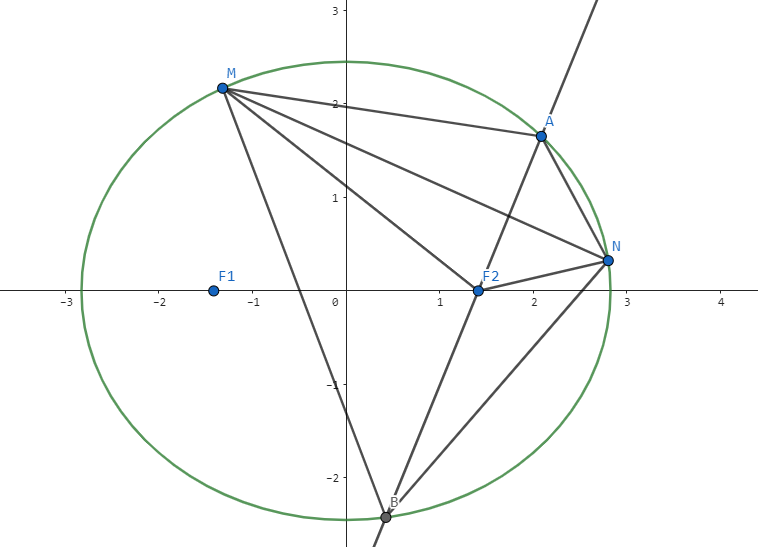

**个人解答**

由 $\mathrm{MF_2,NF_2}$ 是角平分线知 $\mathrm{\frac{|MA|}{|MB|}=\frac{|NA|}{|NB|}=\frac{|AF_2|}{|F_2B|}}$，因此 $\mathrm{M,F_2,N}$ 均在以 $\mathrm{A,B}$ 为定点，两边比为 $\mathrm{\frac{|AF_2|}{|F_2B|}}$ 的阿氏圆上。

由 $\triangle \mathrm{MF_2N}$ 外接圆面积为 $\frac{81}{8}\pi$ 知 $R=\frac{9}{2\sqrt{2}}$，则 $\mathrm{\frac{|F_2A|}{|F_2B|}=\frac{2R-|F_2A|}{2R+|F_2B|}}$，解得 $\frac{1}{|F_2A|}-\frac{1}{|F_2B|}=\frac{1}{R}=\frac{2\sqrt{2}}{9}$。

设 $\angle \mathrm{AF_2C}=\theta$，则 $|F_2A|=\frac{b^2}{a+c\cos \theta},|F_2B|=\frac{b^2}{a-c\cos \theta}$，因此 $\frac{2c\cos \theta}{b^2}=\frac{2\sqrt{2}}{9}$，即 $\cos \theta =\frac{2}{3}$。

因此直线 $m$ 的方程为 $y=\frac{\sqrt{5}}{2}x-\frac{\sqrt{10}}{2}$。