# 日影轨迹追踪

!!! warning "温馨提醒"
    本文写于 2023.01.08，并同步投稿于个人公众号。

    近期在整理时有细微调整。

日影轨迹追踪——记 2021 年浙江高考地理卷第 19 题错题

杭州二中 小 Z

## 摘要

本文将指出 2021 年浙江高考地理卷第 19 题的官方解答错误，并给出正确答案。之后通过建立数学模型，将问题抽象化，理论分析日影轨迹。最后，能给出在任何经纬、任何地点、任何时间段的影子运动轨迹。

## 目录

本文包含如下内容：

- 引入：2021 年浙江高考地理卷第 19 题
    - 传统解答（官方解答）
    - 漏洞
    - 正确解答
- 日影轨迹追踪
    - 与地球自身相关的术语
    - 日影成因及变化原因
    - 太阳直射点
    - 数学建模
    - 粗略分析
    - 春分、秋分日影轨迹初探

## 声明

- 对「2021 年浙江高考地理卷第 19 题」提出质疑的，目前网上只看到一篇，在 B 站上，详见 [参考文献 8]。可见这种事实性错误没能引起大家足够的关注。本文部分图剪辑自原视频。
- 日影轨迹追踪的前半段主要参考了 [参考文献 1]。早在 5 年前，这篇知乎日报就火了，当时我草草阅读过，因为看不懂就关了，但是对其极具创新的设计印象极深。这次我仔细阅读了一通，将我对它的理解写在了本文。本文部分图取自该日报。
- 理论分析主要参考自 [参考文献 3]、[参考文献 4] 和 [参考文献 7]，因为「日影轨迹追踪」这一话题在 2015 年全国大学生数学建模比赛出现过，曾掀起一波热潮，自然留下了很多前人的智慧果实。本文不局限于解决这道高考题（仅考虑纬度），顺带研究了在经度和时间段的条件下日影的轨迹。
- 程序实现原创，日影轨迹绘制参考自 [参考文献 5]，后期加工原创。
- 实验验证主要参考自 [参考文献 2] 和 [参考文献 6]。

## 引入：2021 年浙江高考地理卷第 19 题

  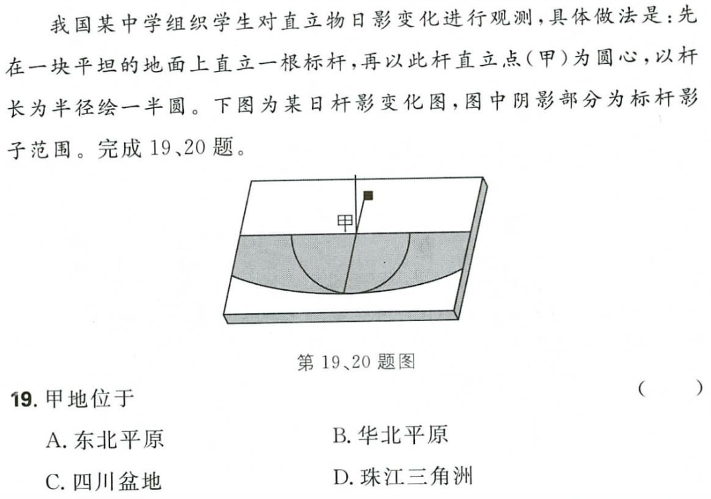

### 传统解答（官方解答）

首先，杆影的范围位于旗杆的一侧，日出影子接近正西方向，日落影子接近正东方向，因此该日为二分日（春分、秋分）。

其次，由图可知正午时，影长等于杆长，因此太阳高度角为 45°。

  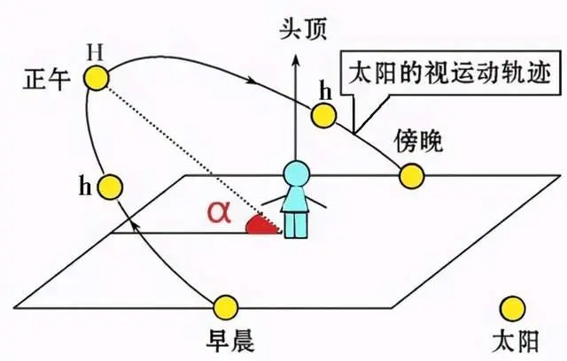

设标杆所处纬度为 $\beta$，太阳直射点纬度为 $\gamma$，由几何关系知，正午太阳高度角 $\alpha=90°-|\beta-\gamma|$。

在二分日，太阳直射赤道，因此 $\gamma=0$，故 $\beta=45°$。

  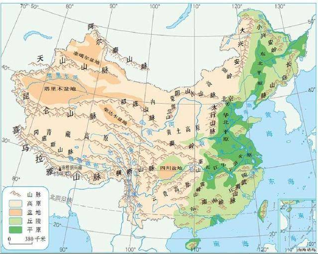

因此该地点在北纬 45° 附近的东北平原，选择 A 选项。

### 漏洞

看上去无懈可击，没任何毛病，那我为啥要坚持认为它是错题呢？

我们是否疏忽了一点：我们只关注了三个极端时影子的朝向，但并没有注意到影子的移动轨迹？

在二分日，影子的轨迹真的是图中所画的那样，形成"双曲线"吗？答案是否定的，它应该是一条直线！

  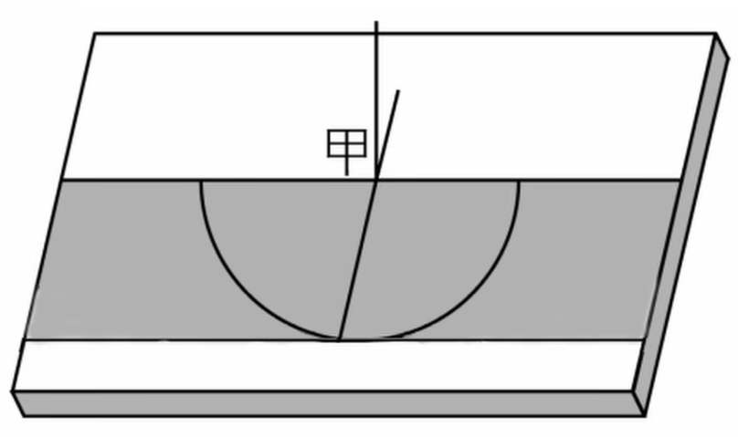

- 春分：[可以看看这个 30 秒钟的延时摄影视频，事实胜于雄辩](https://www.bilibili.com/video/av97910966/?vd_source=eb94c74bc4891d80ab7e673decbf056a)
- 秋分：[可以看看这篇新闻报道，同学实验观测出影子轨迹是直线](https://www.wenmi.com/article/px9mke054094.html)

### 正确解答

那既然轨迹是一条双曲线，又该怎么解释日影均位于标杆的同一侧呢？

唯一合理的解释，想必就是这仅仅只是观测了一个时间段。将日影的轨迹补全后，将会是：

  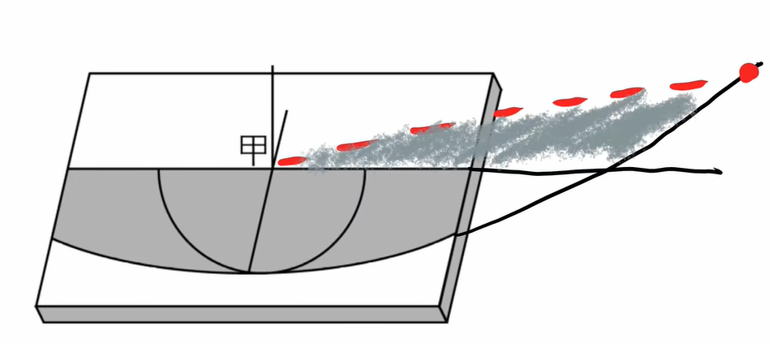

所以我选 E 选项，那真正的答案是什么呢？

（本数据来自 [参考文献 8]）经过「数学建模」与「理论分析」：

- 观测点位于北纬 58°26'；
- 太阳直射北纬 13°26′；
- 对应日期 4 月 26 日或 8 月 17 日；
- 观测时间是真太阳时 6:34 至 17:26。

  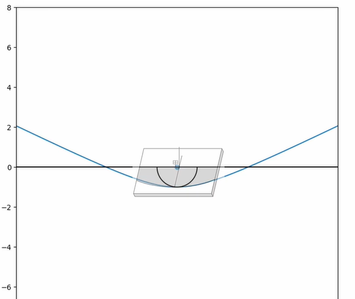

影子轨迹与原图几乎拟合。因此，正确答案是：

  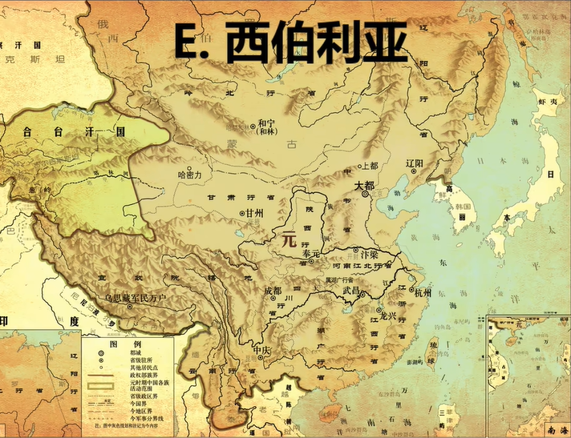

## 日影轨迹追踪

在对其具体分析时，我们先讲一些初中就学过的知识。

### 与地球自身相关的术语

地轴、黄道面、赤道面、南北极、经纬线、南北回归线。

  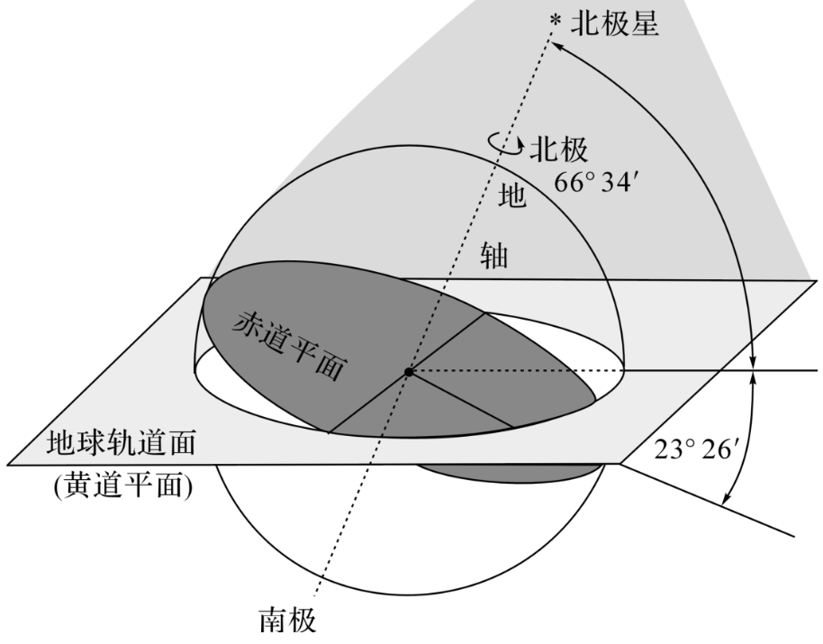

- **地轴**：即地球自转轴，是地球自转所绕的轴，与黄道面的夹角为 66°34′，其北端始终指向北极星附近；
- **赤道面**：与地轴垂直的轨道面，与黄道面的夹角为 23°26′；
- **黄道面**：即地球轨道面，是地球绕太阳公转的轨道平面。

### 日影成因及变化原因

**成因** 物体遮住了太阳光，而光是沿直线传播的，因此会形成一块较暗区域。

**变化原因** 地球自西向东逆时针绕轴自转，因此太阳会东升西落，照射角度的改变导致影子变化。

### 太阳直射点

从这里开始，我们约定：

- 地球近似为球体；
- 地球公转轨道近似为圆；
- 太阳离地球无穷远，有时将光视为平行光束；
- 地球表面局部近似为平面，称其为地平面；
- 若无特殊说明，默认分析的是北半球。

地球绕着太阳公转，太阳是平行于黄道面的平行光源。然而地轴是倾斜的，这就导致了太阳直射点的变化，于是有了一年四季。

  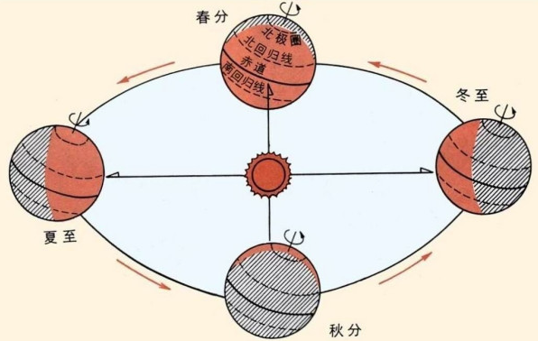
  

  听我说谢谢你，因为有你，温暖了四季
  

太阳直射点的两个极端分别出现在夏至和冬至日，我们称两条极端的轨迹线为北回归线和南回归线。由几何关系知，南北回归线的角度值等于 23°26′。

### 数学建模

为了建模方便，我们以地球为参考系，即杆子不动，那么太阳将绕着地轴自东向西旋转。

  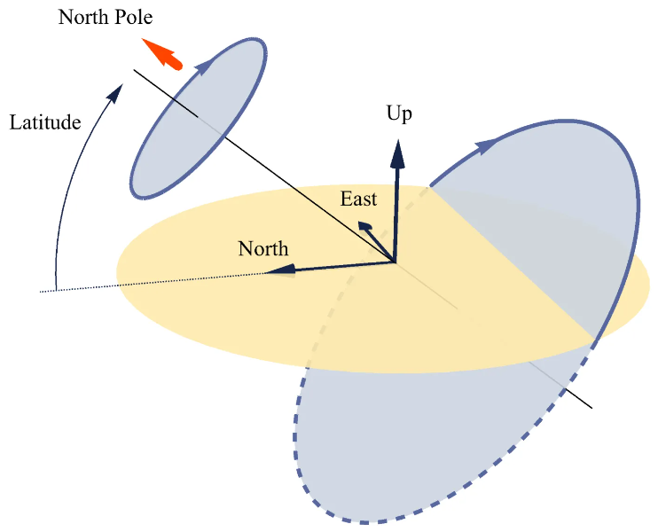

我们引入「天球」模型：从唯象的角度考虑，我们将地平面抽象成一个平面，天空视作一个球，称为"天球"。黄色区域为地平面，杆子垂直于地平面且处于"Up"方向，那么太阳的运动轨迹即为蓝色区域，显然蓝色平面与地轴垂直。

  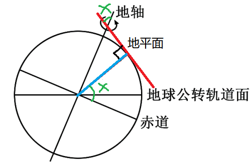

纬度（Latitude）定义为杆到地心的连线与赤道面的夹角，简单导角知地平面与地轴的夹角就是纬度。

太阳在蓝色轨道上运动时，运动到地平线上方，便是日出，运动到地平线下方，便是日落。

  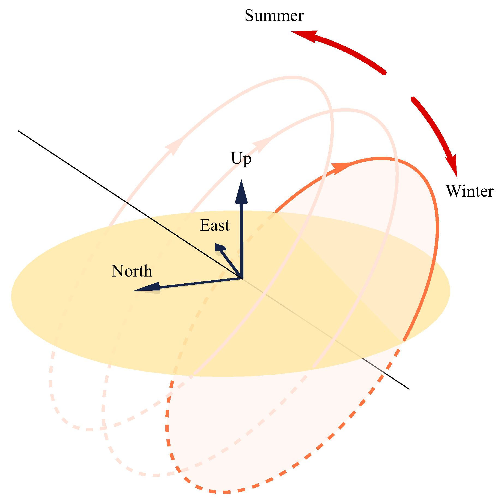

随着地球公转时所处的位置变化，太阳直射点始终在变，所在的纬度也在发生变化。因此，不同的季节，**太阳运动的轨迹线会沿地轴平移**。在夏天，太阳靠北，因此夏季白天长；在冬天，太阳靠南，因此冬季白天短。

### 粗略分析

我们先规避理论计算，粗略估计一下影子的轨迹。

太阳轨迹是一个圆，那么太阳光过杆尖形成……脑海里是否闪过一个念头？仿佛高中就学过！

  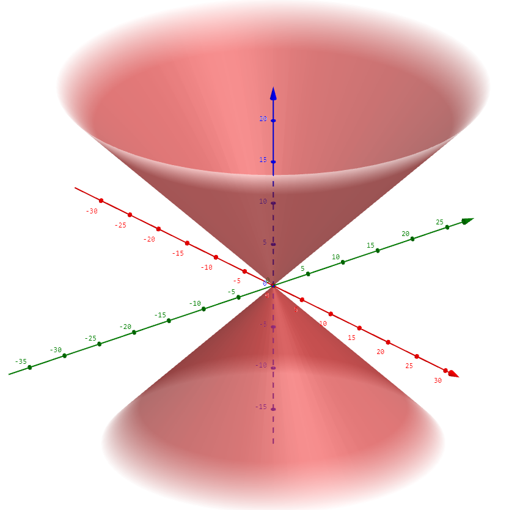

对！形成了二次锥面！那影子的轨迹呢？就是**位于太阳轨迹另一侧的锥面与地平面的交线**！

  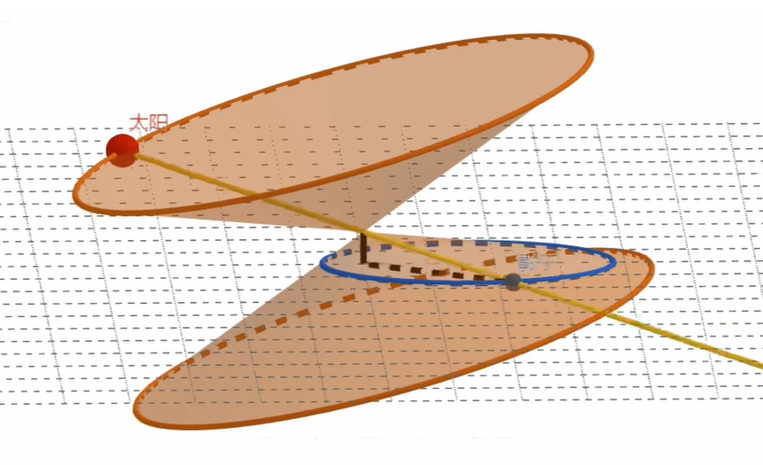

  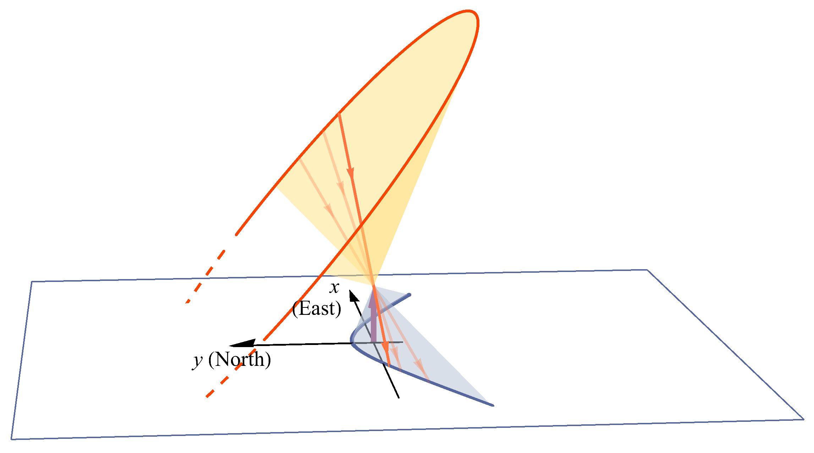

  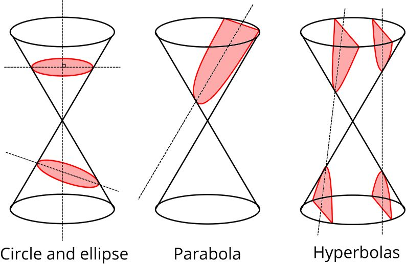

因此，轨迹的类型便很明朗了：圆锥曲线。因此轨迹可以是椭圆、双曲线、圆。

但是，这真的就完了嘛？当然不，容易发现在一定情形下，它会退化为直线。

而这种特殊情形，便是在春秋分时节。

### 春分、秋分日影轨迹初探

> **春分、秋分日影轨迹为直线。**

春分、秋分时节，太阳直射点处于纬度 0° 附近，杆长远小于天体半径，故太阳、杆尖、影子均位于蓝色平面内。

而太阳运动轨迹是个大圆，即蓝色平面是个圆，与地平面的交线为直线。

  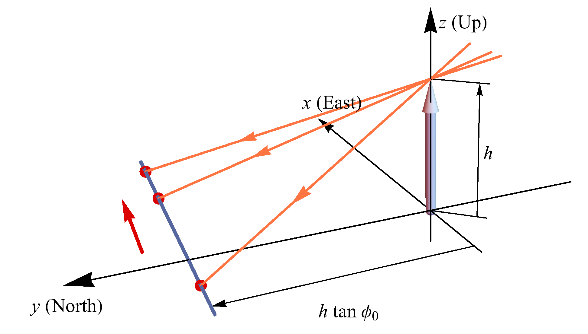

假设当地纬度为 $\varphi_0$，杆长为 $h$，那么由几何关系知影子高度（正午的影长）为 $\frac{h}{\tan\left(\frac{\pi}{2}-\varphi_0\right)}=h\tan\varphi_0$。

## 参考文献

1. [知乎，【知乎日报收录】我用一张纸一支笔，测量了当地纬度](https://zhuanlan.zhihu.com/p/27776139)
2. [bilibili，【实验】我用延时摄影·春分的日影呀～](https://www.bilibili.com/video/av97910966/?vd_source=eb94c74bc4891d80ab7e673decbf056a)
3. [知乎，太阳直射点不落在地球的 A 处，设 A 处一根杆的底端为原点，求从日出到日落它的影子的端点移动的轨迹是什么？](https://www.zhihu.com/question/37023490/answer/70477343)
4. [百度文库，2015 年高教社杯全国大学生数学建模竞赛题目，太阳影子定位](https://wenku.baidu.com/view/9cf6469ed938376baf1ffc4ffe4733687e21fcb8.html)
5. [Desmos，影子每日轨迹](https://www.desmos.com/calculator/in3rjbx7bc?lang=zh-CN)
6. [文秘帮，校园日影轨迹观测实践之构思](https://www.wenmi.com/article/px9mke054094.html)
7. [知乎，立竿测影的太阳投影轨迹和特殊天象分析](https://zhuanlan.zhihu.com/p/456539947)
8. [bilibili，地理高考题目出错！日影运动轨迹竟是圆锥曲线？](https://www.bilibili.com/video/BV1PG4y1774C/?spm_id_from=333.999.0.0&vd_source=eb94c74bc4891d80ab7e673decbf056a)
