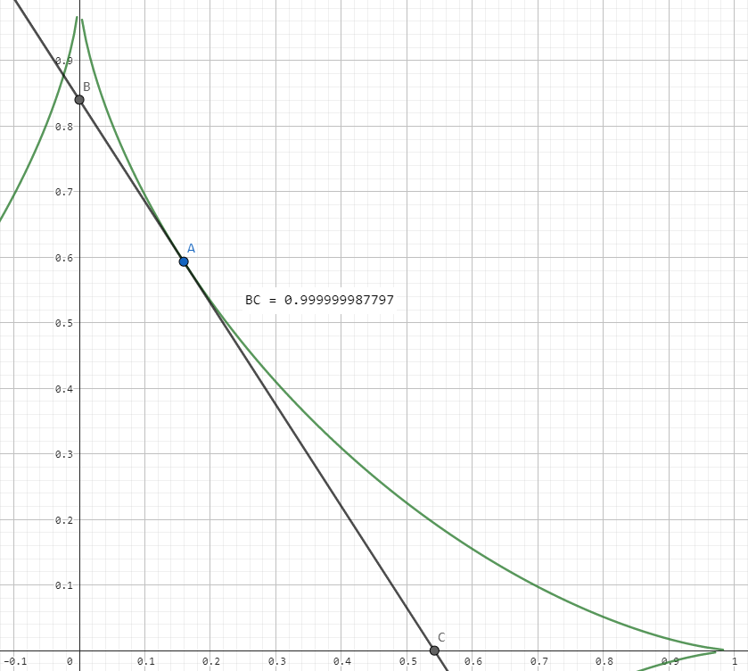
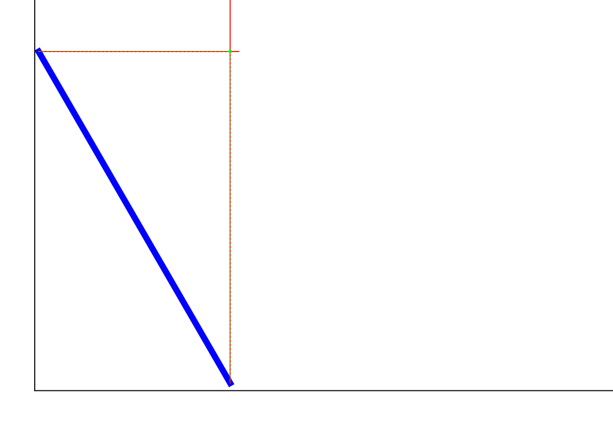
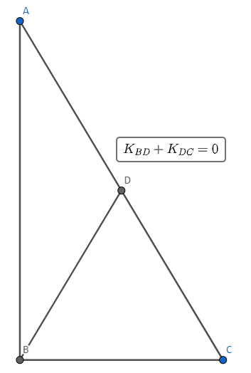
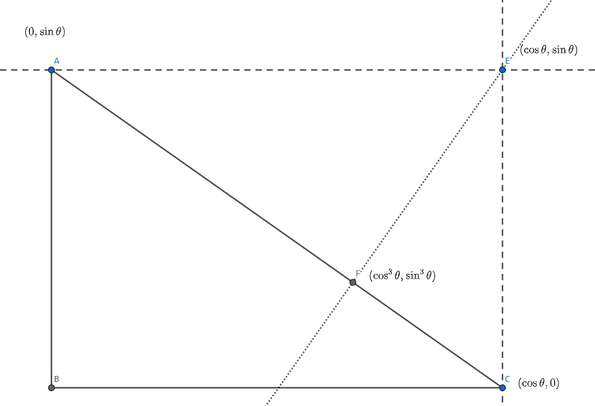

# 木棍运动轨迹与 $x^{2/3}+y^{2/3}=1$ 的本质探究

!!! warning "温馨提醒"
    本文写于 2023.01.06，并同步投稿于个人公众号。

    近期在整理时有细微调整。

木棍运动轨迹与 x^(2/3)+y^(2/3)=1 的本质探究

杭州二中 小 Z

## 引入

我曾记录了这样一个思考题：

> **一般化问题** 设位于第一象限的图像 $x^k+y^k=1\ (k>0)$。有一条直线 $l$ 与图像相切且被 $x,y$ 轴截出一根线段。求这根线段长度的取值范围。

**解答** 变形得 $y=(1-x^k)^{1/k}$，则 $y'=-x^{k-1}(1-x^k)^{1/k-1}$。

设切点为 $\left(x_0,(1-x_0^k)^{1/k}\right)$，则切线方程为

$$
y=-x_0^{k-1}(1-x_0^k)^{1/k-1}(x-x_0)+(1-x_0^k)^{1/k}
$$

因此两交点为 $\left(0,(1-x_0^k)^{1/k-1}\right)$ 和 $\left(x_0^{1-k},0\right)$，设线段长度为 $l$，则

$$
l^2=(1-x_0^k)^{2/k-2}+x_0^{2-2k}
$$

令 $f(x_0)=l^2$，则 $f'(x_0)=(2-2k)\left(x_0^{1-2k}-(1-x_0^k)^{2/k-3}x_0^{k-1}\right)$。

- 若 $k=1$，显然 $l=\sqrt{2}$；
- 若 $k\neq 1$，考虑 $f'(x_0)=0$，得到 $x_0^{(-3+2/k)k}=(1-x_0^k)^{-3+2/k}$。
    - 若 $k=\frac{2}{3}$，则 $f'(x_0)\equiv 0$，故 $l\equiv 1$；
    - 若 $k\neq \frac{2}{3}$，则 $x_0^k=1-x_0^k$，故 $x_0=2^{-1/k}$。

        因此只需要代入 $x=0,1,2^{-1/k}$（注意 $x$ 取不到 $0,1$，$l$ 没有同时和 $x,y$ 轴相交，而出现它们的原因是在计算两交点的时候出现了除以 $0$ 的操作）：

        - 当 $x=0,1$ 时，$l=\begin{cases}1 & k<1 \\ +\infty & k>1\end{cases}$；
        - 当 $x=2^{-1/k}$ 时，$l=2^{3/2-1/k}$。

综上：

$$
|l|\in \begin{cases}
[2^{3/2-1/k},1), & 0<k<\frac{2}{3}\\
\{1\}, & k=\frac{2}{3} \\
(1,2^{3/2-1/k}], & \frac{2}{3}<k<1 \\
\{\sqrt{2}\}, & k=1 \\
[2^{3/2-1/k},+\infty), & k>1
\end{cases}
$$

看上去答案分类很复杂，没啥大不了的。但是，我注意到在 $k=\frac{2}{3}$ 时 $|l|$ 竟然为定值，这简直不可思议！我当时一度怀疑是自己哪一步推导推错了，总不可能这么巧合吧！我心里想着：难道这就像"勒洛三角形"能平稳运动一样，它也是数学中隐含的美吗？

  

## 从"木棍下滑"看这条曲线

我将这一发现分享给了 ZJY 大佬，他提供了一个新的思考角度：

> 一根长度为 $1$ 的木棍立在墙角（平面上），木棍在滑动过程中形成的外轮廓就是曲线 $x^{2/3}+y^{2/3}=1$。
>
> （其实专业叫法是包络线方程，这里为了讲得通俗易懂，所以有失严谨）

  

so……这是如何导出 $\frac{2}{3}$ 次方的呢？对此，我又进行了一些思考，摸索出了其本质。

## 想法一：几何 + 代数

从"斜边中线 + 权方和不等式"角度的理解。

直接去勾勒出这条曲线，显然计算量过大，且不利于触及 $\frac{2}{3}$ 的本质。因此我们先考虑：

> 对于一个点 $(x_0,y_0)\ (x_0,y_0>0)$，如何判断它与曲线的位置关系？

我们定义直线 $l$ 的长度为它与 $x,y$ 轴截成线段的长度。考虑过 $(x_0,y_0)$ 的直线系 $\mathbb S$，设最短的直线长度为 $s$（即 $s=\min\limits_{l\in \mathbb S}s_l$），则显然：

$$
\begin{cases}\text{在曲线内}, & s < 1\\ \text{在曲线上}, & s = 1\\ \text{在曲线外}, & s > 1\end{cases}
$$

接下来问题就转化为去计算 $s$ 了，但是 $s$ 表达式较冗长，怎么办呢？

联想初中学过的直角三角形的斜边中线是斜边长的一半，所以如果知道了斜边中点坐标 $(x_1,y_1)$，那么 $s$ 直接可以表示为 $s=2\sqrt{x_1^2+y_1^2}$。

  

直角三角形的斜边中线可有不少性质，例如 $K_{BD}+K_{DC}=0$，也就是说：

$$
\begin{aligned}
&&\frac{y_1}{x_1}+\frac{y_1-y_0}{x_1-x_0}&=0 \\
&\Rightarrow& \frac{x_0}{x_1}+\frac{y_0}{y_1}&=2
\end{aligned}
$$

现在我们的目标是最小化 $(x_1,y_1)$ 到原点的距离 $\sqrt{x_1^2+y_1^2}$，这显然可以一步权方和不等式得到：

$$
\frac{x_0}{x_1}+\frac{y_0}{y_1}=\frac{(x_0^{2/3})^{3/2}}{\sqrt{x_1^2}}+\frac{(y_0^{2/3})^{3/2}}{\sqrt{y_1^2}}\ge \frac{(x_0^{2/3}+y_0^{2/3})^{3/2}}{\sqrt{x_1^2+y_1^2}}
$$

因此 $s=\left(2\sqrt{x_1^2+y_1^2}\right)_{\min}=(x_0^{2/3}+y_0^{2/3})^{3/2}$，曲线的方程为 $x^{2/3}+y^{2/3}=1$。

### 为什么是 2/3

为什么偏偏会得到 $\frac{2}{3}$ 这个看似很奇怪的值呢？可以发现在上述推导中，我们在权方和不等式的时候，因为要把分母放缩成距离，所以改写为 $\frac{1}{2}$ 次方。那么分子对应就要 $\frac{3}{2}$ 次方，那 $x$ 就变成了 $\frac{2}{3}$ 次方。

因此其本质回归到了为啥放缩时分子偏偏要比分母高 $1$ 次，我们通过解释权方和不等式的推导解释。

> **权方和不等式** $\sum\frac{a_i^{m+1}}{b_i^m}\ge \frac{(\sum a_i)^{m+1}}{(\sum b_i)^m}$，其中 $a_i,b_i,m\in \mathbb R^+$。
>
> **取等条件** 在 $\frac{a_i}{b_i}$ 相等时取等。

权方和不等式本质上是 Hölder 定理的特殊情形，但是证明它在 $a_i,b_i,m>0$ 时成立有非常直观的方法：

不妨假设 $\sum b_i=1$，否则将 $b_i\leftarrow \frac{b_i}{\sum b_i}$，不影响不等号。那么我们等价于要证明

$$
\begin{aligned}
&\iff& \sum \frac{a_i^{m+1}}{b_i}&\ge\left(\sum a_i\right)^{m+1}\\
&\iff& \sum b_i\left(\frac {a_i}{b_i}\right)^{m+1}&\ge\left(\sum a_i\right)^{m+1}
\end{aligned}
$$

设 $x_i=\frac{a_i}{b_i}$，则 $a_i=b_i\cdot x_i$，于是：

$$
\sum b_i(x_i)^{m+1}\ge\left(\sum b_ix_i\right)^{m+1}
$$

令 $f(x)=x^{m+1}$，由 $f''(x)=(m+1)\cdot m\cdot x^{m-1}>0$ 知在 $x\in (0,+\infty)$ 时 $f(x)$ 下凸。

根据凸函数的性质"自变量的加权平均的函数值，小于等于函数值的加权平均"，结合 $\sum b_i=1$ 知成立。

由上可见，这里次数高的 $1$ 次，是用来提供分配系数了（即 $\sum b_i=1$）。所以本质就是计算长度的次数为 $\frac{1}{2}$ 次，有 $1$ 次用来分配系数，因此曲线方程的次数是 $\dfrac{1}{1+\frac{1}{2}}=\dfrac{2}{3}$。

## 想法二：力学

从"运动学"角度的理解。

假设木棍正在下落，那么木棍切点的速度方向与棒的速度相同。

我们将木棍的运动分解为平动与转动。设两端点分别为 $\mathrm{A,B}$，坐标分别为 $(0,\sin\theta)$，$(\cos\theta,0)$。

  

那么木棍的转动中心就是 $\mathrm{A,B}$ 运动方向的垂直线的交点 $\mathrm{E}$，坐标为 $(\cos\theta,\sin\theta)$。

因此，沿木棍方向运动的点为转动中心与木棍的垂足 $\mathrm{F}$，由射影定理知坐标为 $(\cos^3\theta,\sin^3\theta)$。

结合 $\cos^2\theta+\sin^2\theta=1$，可得曲线的方程为 $x^{2/3}+y^{2/3}=1$。

## 参考文献

1. [知乎，平稳运动不只是圆形，也可能是勒洛三角形](https://zhuanlan.zhihu.com/p/405346482)
2. [知乎，如何用高中知识证明权方和不等式？](https://www.zhihu.com/question/338180916/answer/906192491)
3. [知乎，权方和不等式的证明以及在任意实数次幂的推广](https://zhuanlan.zhihu.com/p/584042236)
4. [知乎，将一根小棍放在墙角，让它往下滑，那么它扫过的曲线的解析式是什么？](https://www.zhihu.com/question/48489626/answer/111150441)
5. [维基百科，包络线](https://zh.wikipedia.org/zh-hans/%E5%8C%85%E7%B5%A1%E7%B7%9A)
