# 圆锥曲线

> 这是我高中时名为"圆曲妙妙屋"的专栏，谨以此记录我的青春。
>
> Fri, 17th Nov 2023, 杭州二中小 Z

## 高考卷好题记录

| 完成情况 | 题源 | 命题背景 | 简洁解法 | 收录 |
| :---: | :---: | :---: | :---: | :---: |
| ✓ | 2024·上海春考 | / | easy | |
| ✓ | 2023·全国甲卷 | / | easy | |
| ✓ | 2023·全国乙卷 | 极点极线, 调和点列, 调和线束 | 齐次化 | ✓ |
| ✓ | 2023·新高考 I 卷 | [N/A] | | |
| ✓ | 2023·新高考 II 卷 | 自极三角形 | 齐次化, 第三定义 | ✓ |
| ✓ | 2023·北京卷 | 帕斯卡定理 (退化), 仿射变换, 四点共圆 | 同一法 | ✓ |
| ✓ | 2023·上海卷 | / | easy | |
| ✓ | 2023·天津卷 | / | easy | |
| ✓ | 2022·全国甲卷 | (抛物线) 蝴蝶定理 | easy | |
| ✓ | 2022·全国乙卷 | 极点极线, 调和点列, 调和线束 | 齐次化, 同一法 | |
| ✓ | 2022·新高考 I 卷 | 圆锥曲线上的四点共圆 (退化), 拉格朗日中值的几何意义 | 齐次化 | |
| ✓ | 2022·新高考 II 卷 | 渐近线引理, 相似 | 曲线系, 同一法 | ✓ |
| ✓ | 2022·浙江卷 | 对合变换 | 齐次化, 参数方程 | ✓ |
| ✓ | 2022·天津卷 | / | 参数方程 | |
| ✓ | 2021·全国甲卷 | 彭赛列闭合定理 | 设点法 | |
| ✓ | 2021·全国乙卷 | / | easy | |
| ✓ | 2021·新高考 I 卷 | 圆锥曲线上的四点共圆 | 曲线系, 参数方程 | ✓ |
| ✓ | 2021·新高考 II 卷 | / | easy | |
| ✓ | 2021·浙江卷 | / | 设线硬算 (待优化) | ✓ |
| ✓ | 2021·北京卷 | / | easy | |
| ✓ | 2020·全国 I 卷 | 自极三角形 | 齐次化 | |
| ✓ | 2020·全国 III 卷 | / | easy | |
| ✓ | 2020·新高考 I 卷 | 对合变换 | 齐次化 | |
| ✓ | 2020·浙江卷 | / | 设点法, 中点弦 | ✓ |
| ✓ | 2020·北京卷 | 极点极线, 调和点列, 调和线束 | 齐次化 | |
| ✓ | 2020·天津卷 | / | easy | |

!!! problem "2023·全国乙卷，20（命题背景：极点极线, 调和点列, 调和线束）"
    已知椭圆 $\mathrm{C}:\ \frac{y^2}{9}+\frac{x^2}{4}=1$，点 $\mathrm{A}\ (-2,0)$。

    （2）过点 $\mathrm{T}\ (-2,3)$ 的直线交 $\mathrm{C}$ 于 $\mathrm{P,Q}$ 两点，直线 $\mathrm{AP,AQ}$ 与 $y$ 轴的交点分别为 $\mathrm{M,N}$，证明：线段 $\mathrm{MN}$ 的中点为定点。

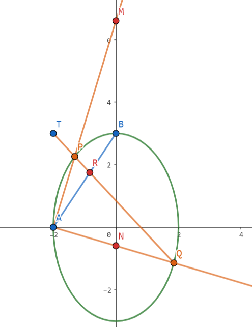

**极点极线 + 调和点列 + 调和线束**

注意到 $\mathrm{AB}$ 为 $\mathrm{T}$ 的极线，故 $\mathrm{T,P,R,Q}$ 为调和点列。

调和线束 $\mathrm{AT,AP,AR,AQ}$ 与 $y$ 轴分别交于 $\mathrm{D,M,B,N}$，故 $\mathrm{D,M,B,N}$ 为调和点列，其中 $\mathrm{D}$ 为无穷远点。

由 $\mathrm{\frac{|NB|}{|BM|}=\frac{|ND|}{|DM|}=1}$ 知 $\mathrm{B}$ 为 $\mathrm{MN}$ 中点，故定点为 $(0,3)$。

**齐次化**

设点 $\mathrm{P}\ (x_1,y_1),\ \mathrm{Q}\ (x_2,y_2)$，则 $\mathrm{AP}:\ y=\frac{y_1}{x_1+2}(x+2)$，故 $\mathrm{M}\ (0,\frac{2y_1}{x_1+2})$。同理 $\mathrm{N}\ (0,\frac{2y_2}{x_2+2})$。

设点 $\mathrm{M,N}$ 的中点为 $\mathrm{R}\ (0,\frac{y_1}{x_1+2}+\frac{y_2}{x_2+2})$，这启发我们用齐次化处理。

设 $\mathrm{PQ}: m(x+2)+ny=1$，由 $\mathrm{PQ}$ 过 $(-2,3)$ 知 $n=\frac{1}{3}$。

联立得 $\frac{1}{9}\left(\frac{y}{x+2}\right)^2-\frac{1}{3}\left(\frac{y}{x+2}\right)+\frac{1}{4}-m=0$，因此 $y_R=3$，即定点 $(0,3)$。

---

!!! problem "2023·新高考 II 卷，21（命题背景：自极三角形）"
    已知双曲线 $\mathrm{C}:\ \frac{x^2}{4}-\frac{y^2}{16}=1$，左右顶点分别为 $\mathrm{A_1,A_2}$。

    （2）过点 $\mathrm{T}\ (-4,0)$ 的直线交 $\mathrm{C}$ 的左支于 $\mathrm{M,N}$ 两点，$\mathrm{M}$ 在第二象限，直线 $\mathrm{MA_1}$ 与直线 $\mathrm{NA_2}$ 交于点 $\mathrm{P}$。证明：点 $\mathrm{P}$ 在定直线上。

**自极三角形**

对于双曲线上的四边形 $\mathrm{M,N,A_1,A_2}$，对边交点为 $\mathrm{T}$，对角线交点为 $\mathrm{P}$，由自极三角形知 $\mathrm{P}$ 在 $\mathrm{T}$ 的极线 $x=-1$ 上。

**齐次化 + 第三定义**

注意到直线 $\mathrm{MN}$ 过定点，由对合变换知直线 $\mathrm{MA_2,NA_2}$ 斜率积为定值。证明采用齐次化：

设 $\mathrm{MN}:\ m(x-2)+ny=1$，代入 $(-4,0)$ 得 $m=-\frac{1}{6}$，联立得 $-\frac{1}{16}\left(\frac{y}{x-2}\right)^2+n\left(\frac{y}{x-2}\right)+\frac{1}{12}=0$。

因此 $k_{MA_2}\cdot k_{NA_2}=-\frac{4}{3}$，由双曲线的第三定义知 $k_{MA_2}\cdot k_{MA_1}=4$，故 $\frac{k_{A_1P}}{k_{A_2P}}=-3\Rightarrow x_P=-1$。

---

!!! problem "2023·北京，19（命题背景：帕斯卡定理 (退化) / 仿射变换, 四点共圆）"
    已知椭圆 $\mathrm{E}:\ \frac{x^2}{9}+\frac{y^2}{4}=1$，$\mathrm{A,C}$ 分别是 $\mathrm{E}$ 的上下顶点，$\mathrm{B,D}$ 分别是 $\mathrm{E}$ 的左右顶点。

    （2）设 $\mathrm{P}$ 为第一象限内 $\mathrm{E}$ 上的动点，直线 $\mathrm{PD}$ 与直线 $\mathrm{BC}$ 交于点 $\mathrm{M}$，直线 $\mathrm{PA}$ 与直线 $y=-2$ 交于点 $\mathrm{N}$，求证：$\mathrm{MN}\parallel \mathrm{CD}$。

**帕斯卡定理（退化）**

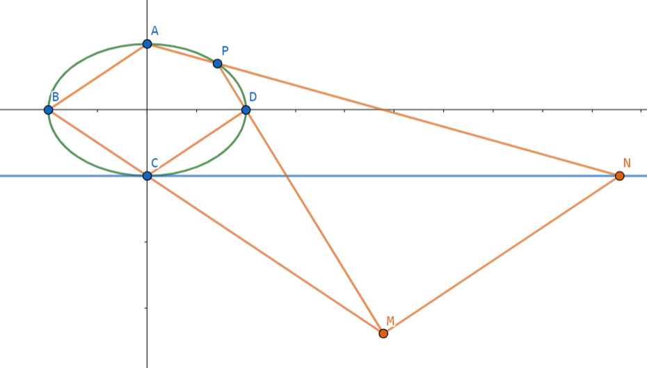

对于 (退化) 六边形 $\mathrm{CCDPAB}$ 使用帕斯卡定理，$\mathrm{CC}\cap \mathrm{PA}=\mathrm{N},\mathrm{CD}\cap \mathrm{AB}=\mathrm{Q},\mathrm{DP}\cap \mathrm{BC}=\mathrm{M}$，则 $\mathrm{N,Q,M}$ 三点共线。又 $\mathrm{Q}$ 是无穷远点，因此 $\mathrm{MN}\parallel \mathrm{AB}\parallel \mathrm{CD}$。

**仿射变换 + 四点共圆**

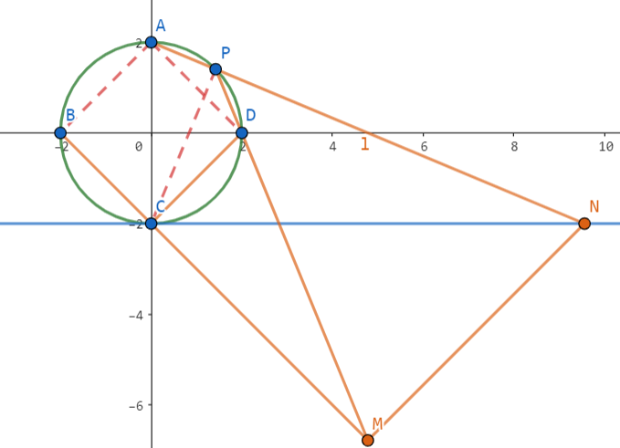

考虑将椭圆 $\mathrm{E}$ 仿射变换为 $\frac{x^2}{4}+\frac{y^2}{4}=1$，则四边形 $\mathrm{ABCD}$ 为正方形。

由 $\mathrm{A,B,D,P}$ 四点共圆知 $\angle \mathrm{NPM}=\angle \mathrm{ABD}=45^\circ$。显然 $\angle \mathrm{NCM}=45^\circ$，因此 $\mathrm{P,N,M,C}$ 四点共圆。

故 $\angle \mathrm{NMC}=\angle \mathrm{APC}=90^\circ$，而 $\angle \mathrm{DCB}=90^\circ$，故 $\mathrm{MN}\parallel \mathrm{CD}$。

**仿射变换的常见性质**

- 同素性：变换后，点仍是点，线仍是线
- 结合性：变换后，在直线上的点仍在直线上
- 斜率比不变, 面积比不变
- 平行关系不变, 共线线段比例关系不变, 点分线段比不变

**同一法**

朴素做法是设点 $\mathrm{P}\ (x_0,y_0)$，然后表示出点 $\mathrm{N,M}$，进而爆算论证 $k_{NM}=\frac{2}{3}$，但是计算量太大。

考虑同一法，我们去设点 $\mathrm{N}\ (t,-2)$，然后作 $\mathrm{NM'}\parallel \mathrm{CD}$ 交直线 $\mathrm{BC}$ 于 $\mathrm{M'}$，如果能说明 $\mathrm{P,D,M'}$ 三点共线，则由同一法知成立（因为 $\mathrm{BC}$ 与 $\mathrm{PD}$ 交点唯一）。

直线 $\mathrm{AN}:\ y=-\frac{4}{t}x+2$，联立 $\mathrm{E}$ 易得 $\mathrm{P}\ (\frac{36t}{36+t^2},\frac{2t^2-72}{36+t^2})$。

再联立 $\begin{cases}\mathrm{BC}:\ y=-\frac{2}{3}x-2 \\ \mathrm{NM'}:\ y=\frac{2}{3}(x-t)-2\end{cases}$，易得 $\mathrm{M'}\ (\frac{t}{2},-\frac{t}{3}-2)$。

最后由 $\vec{\mathrm{PD}}=(\frac{108+3t^2-36t}{36+t^2},\frac{72-2t^2}{36+t^2})$，$\vec{\mathrm{DM'}}=(\frac{t}{2}-3,-\frac{t}{3})$ 知 $\vec{\mathrm{PD}} \parallel \vec{\mathrm{DM'}}$，故 $\mathrm{P,D,M'}$ 三点共线，命题成立。

---

!!! problem "2022·新高考 II 卷，21（命题背景：渐近线引理，相似）"
    已知双曲线 $\mathrm{C}:\ x^2-\frac{y^2}{3}=1$，右焦点为 $\mathrm{F}\ (2,0)$。过 $\mathrm{F}$ 的直线与 $\mathrm{C}$ 的两条渐近线分别交于 $\mathrm{A,B}$ 两点，点 $\mathrm{P}\ (x_1,y_1),\ \mathrm{Q}\ (x_2,y_2)$ 在 $\mathrm{C}$ 上，且 $x_1>x_2>0,\ y_1>0$。过 $\mathrm{P}$ 且斜率为 $-\sqrt{3}$ 的直线与过 $\mathrm{Q}$ 且斜率为 $\sqrt{3}$ 的直线交于点 $\mathrm{M}$，从下面 (1)(2)(3) 中选取两个作为条件，证明另外一个成立。

    (1) $\mathrm{M}$ 在 $\mathrm{AB}$ 上；(2) $\mathrm{PQ}\parallel \mathrm{AB}$；(3) $\mathrm{|MA|=|MB|}$。

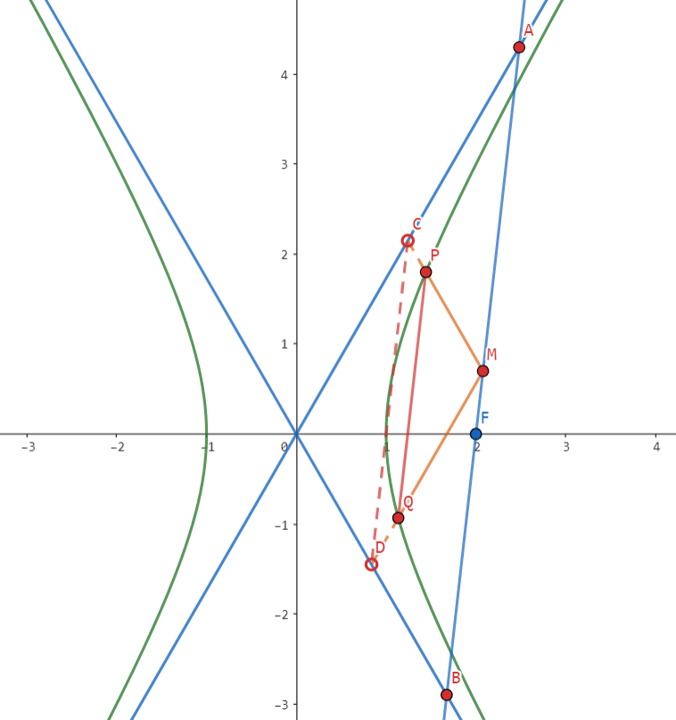

**渐近线引理 + 相似**

我们考虑一般化的双曲线 $\frac{x^2}{a^2}-\frac{y^2}{b^2}=1$。

由于渐近线方程为 $\frac{x^2}{a^2}-\frac{y^2}{b^2}=0$，它与双曲线方程**仅差在常数项上（核心）**，因此两者间存在大量性质。

这里大体罗列部分性质（待完善）：

- $\tau$ 上点 $\mathrm{M}$ 分别作两平行线，围成的平行四边形面积为定值
- 过点 $\mathrm{M}$ 作直线交 $\tau$ 于点 $\mathrm{A,B}$，渐近线于点 $\mathrm{C,D}$，则 $\mathrm{|AC|}=\mathrm{|BD|}$

在本题要用到的性质是：$\mathrm{PQ}\parallel \mathrm{CD}$。

证明采用曲线系：设点 $\mathrm{M}\ (x_0,y_0)$，则双曲线 $\mathrm{C}:\ \frac{x^2}{a^2}-\frac{y^2}{b^2}=1$，渐近线 $\mathrm{l_1}:\ \frac{x^2}{a^2}-\frac{y^2}{b^2}=0$，过 $\mathrm{M}$ 的两条线 $\mathrm{l_2}:\ \frac{(x-x_0)^2}{a^2}-\frac{(y-y_0)^2}{b^2}=0$。

直线 $\mathrm{PQ}:\ \frac{2x_0x}{a^2}-\frac{x_0^2}{a^2}-\frac{2y_0y}{b^2}+\frac{y_0^2}{b^2}=1$，直线 $\mathrm{CD}:\ \frac{2x_0x}{a^2}-\frac{x_0^2}{a^2}-\frac{2y_0y}{b^2}+\frac{y_0^2}{b^2}=0$，显然斜率相等。

**(1)(2) ⇒ (3)**：显然 $\triangle \mathrm{OCD}\sim \mathrm{OAB}$，设 $\frac{|OD|}{|OB|}=\frac{|OC|}{|OA|}=\lambda$，则 $\frac{|AM|}{|AB|}=\frac{|BM|}{|AB|}=1-\lambda$，因此 $2(1-\lambda)=1\Rightarrow \lambda=\frac 12$，故 $\mathrm{|MA|=|MB|}$。

**(1)(3) ⇒ (2)**：由 $\triangle \mathrm{ACM}\sim \triangle \mathrm{AOB}$ 知 $\mathrm{|OD|}=\frac{1}{2}\mathrm{|OB|}$，同理 $\mathrm{|OC|}=\frac{1}{2}\mathrm{|OA|}$，因此 $\mathrm{PQ}\parallel \mathrm{AB}$。

**(2)(3) ⇒ (1)**：同一法易证（证 $\mathrm{AB}$ 中点 $\mathrm{M'}$ 符合条件，而平行线交点唯一），其他过程与前面类似。

---

!!! problem "2022·浙江卷，21（命题背景：对合变换）"
    已知椭圆 $\tau: \frac{x^2}{12}+y^2=1$，设 $\mathrm{A,B}$ 是椭圆上异于 $\mathrm{P}\ (0,1)$ 的两点，且点 $\mathrm{Q}\ (0,\frac 12)$ 在线段 $\mathrm{AB}$ 上，直线 $\mathrm{PA,PB}$ 分别交直线 $y=-\frac 12 x+3$ 于 $\mathrm{C,D}$ 两点。

    （2）求 $|\mathrm{CD}|$ 的最小值。

**齐次化 + 参数方程**

注意到直线 $\mathrm{AB}$ 过定点，由对合变换知**直线 $\mathrm{PA,PB}$ 斜率积为定值**。证明采用齐次化：

设 $\mathrm{AB}:\ mx+n(y-1)=1$，代入 $\mathrm{Q}\ (0,\frac{1}{2})$ 得 $n=-2$，联立 $\tau$ 得 $-3\left(\frac{y-1}{x}\right)^2+2m\left(\frac{y-1}{x}\right)+\frac{1}{12}=0$，因此 $k_{PA}\cdot k_{PB}=-\frac{1}{36}$。

这之后要求的东西就跟椭圆无关了，问的是长度，因此宜用参数方程，设 $\mathrm{CD}: \begin{cases}x=\frac{2}{\sqrt{5}}t \\ y=3-\frac{1}{\sqrt{5}} t\end{cases}$

则 $k_{PA}\cdot k_{PB}=\left(\frac{2\sqrt{5}-t_1}{2t_1}\right)\cdot \left(\frac{2\sqrt{5}-t_2}{2t_2}\right)$，化简得 $t_1t_2=\frac{9\sqrt{5}}{5}(t_1+t_2)-18$，于是：

$$
\begin{aligned}
|\mathrm{CD}|&=|t_1-t_2|\\
&=\sqrt{(t_1+t_2)^2-4t_1t_2}\\
&=\sqrt{(t_1+t_2)^2-\frac{36\sqrt{5}}{5}(t_1+t_2)+72}\ge \frac{6\sqrt{5}}{5}
\end{aligned}
$$

在 $t_1+t_2=\frac{18\sqrt{5}}{5}$ 时取等。

---

!!! problem "2022·浙江，21（命题背景：极点极线）"
    已知椭圆 $\frac{x^2}{8}+\frac{y^2}{4}=1$，左右焦点分别为 $\mathrm{F_1,F_2}$，$\mathrm{A,B}$ 是椭圆上两点，$\mathrm{F_1}$ 是 $\triangle \mathrm{ABF_2}$ 的重心。

    （2）设 $\mathrm{C,D}$ 是椭圆上两点，$\mathrm{F_1}$ 在直线 $\mathrm{CD}$ 上的投影为 $\mathrm{P}$，证明：$|PC|\cdot |PD|$ 为定值。

**极点极线**

由 $\mathrm{F_1}$ 关于椭圆的极线为 $x=-2$ 知，$\mathrm{P}$ 在 $x=-2$ 上。

设 $\mathrm{P}\ (-2,t)$，则 $\mathrm{CD}:\ y=\frac{1}{t}(x+2)+t$，联立椭圆得 $(t^2+2)y^2-2t^3y-4t^2-8=0$。

因此 $|PC|\cdot |PD|=\sqrt{1+t^2}|y_C-y_D|=\sqrt{1+t^2}\cdot \frac{4\sqrt{2(t^2+1)(t^2+2)}}{t^2+2}=4\sqrt{2}$。

---

!!! problem "2021·全国甲卷，20（命题背景：彭赛列闭合定理）"
    抛物线 $\mathrm{C}:\ y^2=x$，圆 $\mathrm{M}:\ (x-2)^2+y^2=1$。

    （2）设 $\mathrm{A_1,A_2,A_3}$ 是 $\mathrm{C}$ 上的三个点，直线 $\mathrm{A_1A_2,A_1A_3}$ 均与 $\mathrm{M}$ 相切，判断 $\mathrm{A_2A_3}$ 与 $\mathrm{M}$ 的位置关系，并说明理由。

**设点法**

抛物线上有天然的优美"斜率"形式，我们好好利用它。设三个点的坐标为 $(x_i,y_i)\ (i=1,2,3)$。

则直线 $\mathrm{AB}:\ (y_1+y_2)y-x-y_1y_2=0$，与 $\mathrm{M}$ 的距离为 $\frac{|2+y_1y_2|}{\sqrt{1+(y_1+y_2)^2}}=1$。

同理解得 $\begin{cases}(2+y_1y_2)^2=1+(y_1+y_2)^2 \\ (2+y_1y_3)^2=1+(y_1+y_3)^2\end{cases}$，我们只需要证 $(2+y_2y_3)^2=1+(y_2+y_3)^2$。

由同构知 $y_2,y_3$ 为 $(y_1^2-1)t^2+2y_1 t+3-y_1^2=0$ 的两根，因此 $\begin{cases}y_2+y_3=\frac{2y_1}{1-y_1^2} \\ y_2y_3=\frac{y_1^2-3}{1-y_1^2}\end{cases}$。

回代易知 $\begin{cases}(2+y_2y_3)^2= \left(\frac {1+y_1^2}{1-y_1^2}\right)^2\\ 1+(y_2+y_3)^2=\left(\frac {1+y_1^2}{1-y_1^2}\right)^2\end{cases}$，因此 $\mathrm{A_2A_3}$ 与 $\mathrm{M}$ 相切。

---

!!! problem "2021·新高考 I 卷，21（命题背景：圆锥曲线上的四点共圆）"
    已知曲线 $\tau: x^2-\frac{y^2}{16}=1$。设点 $\mathrm{T}$ 在直线 $x=\frac 12$ 上，过 $\mathrm{T}$ 的两条直线分别交 $\mathrm{C}$ 于点 $\mathrm{A,B}$ 两点和 $\mathrm{P,Q}$ 两点，且 $\mathrm{|TA|\cdot |TB|=|TP|\cdot |TQ|}$，求 $k_{AB}+k_{PQ}$。

显然它等价于 $\mathrm{A,B,P,Q}$ 四点共圆，结论是：**圆锥曲线上四点共圆，则对边的倾斜角互补。**

**方法一：曲线系（有扣分风险）**

设直线 $\mathrm{AB}:\ y=k_1(x-\frac{1}{2})+m$，直线 $\mathrm{PQ}:\ y=k_2(x-\frac{1}{2})+m$。于是过 $\mathrm{A,B,P,Q}$ 四点的圆方程为：

$$
\left(y-k_1x+\frac{k_1}{2}-m\right)\left(y-k_2x+\frac{k_2}{2}-m\right)=0
$$

由于圆方程的形式为 $Ax^2+By^2+Dx+Ey+F=0\ (A=B)$，故 $xy$ 项前系数为 $0$，即 $k_1+k_2=0$。

**备注** 用曲线系，不仅可以判定四点是否共圆，还可以顺带求出圆方程。

**方法二：参数方程**

设 $\mathrm{T}(\frac{1}{2},t)$，直线 $\mathrm{AB}$ 的参数方程为 $\begin{cases} x=\frac{1}{2}+l\cos \alpha \\ y=t+l\sin \alpha\end{cases}$，直线 $\mathrm{PQ}$ 的参数方程为 $\begin{cases} x=\frac{1}{2}+l\cos \beta \\ y=t+l\sin \beta\end{cases}$。

联立 $\mathrm{AB}$ 与 $\tau$ 得

$$
(16\cos^2\alpha-\sin^2\alpha)l^2+(16\cos \alpha-2t\sin\alpha)l-t^2-12=0
$$

因此 $\mathrm{|TA|\cdot |TB|}=|l_1l_2|=\frac{-t^2-12}{16\cos^2\alpha-\sin^2\alpha}$，同理知 $\mathrm{|TP|\cdot |TQ|}=|l_3l_4|=\frac{-t^2-12}{16\cos^2\beta-\sin^2\beta}$。

由 $\mathrm{|TA|\cdot |TB|=|TP|\cdot |TQ|}$ 知 $\sin\alpha=\sin \beta$，因此 $\alpha+\beta=\pi$ 或 $\alpha=\beta$（舍）。

因此 $k_1+k_2=0$。

---

!!! problem "2021·浙江卷，21"
    已知 $\mathrm{F}\ (1,0)$ 是抛物线 $y^2=4x$ 的焦点，$\mathrm{M}\ (-1,0)$ 在准线上。

    （2）设过点 $\mathrm{F}$ 的直线交抛物线于 $\mathrm{A,B}$ 两点，斜率为 $2$ 的直线 $l$ 与直线 $\mathrm{MA,MB,AB,x}$ 轴依次交于点 $\mathrm{P,Q,R,N}$，且 $\mathrm{|RN|^2=|PN|\cdot |QN|}$，求直线 $l$ 在 $x$ 轴上截距的范围。

**广泛设线，巧妙韦达转化**

我们一次性把每条直线都表示出来：$\begin{cases}\mathrm{AB}:\ x=my+1 \\ \mathrm{l}:\ x=\frac{1}{2}y+t \\ \mathrm{MA,MB}:\ x=ny-1\end{cases}$。

容易口算出 $y_P=\frac{t+1}{n_1-\frac 12}$，$y_Q=\frac{t+1}{n_2-\frac 12}$，$y_R=\frac{t-1}{m-\frac 12}$。

接下来一步很重要，就是注意到 $\mathrm{A,B}$ 是在抛物线上的，通过联立直线 $\mathrm{MA,AB}$，我们可以解出 $\mathrm{A}\ (\frac{n_1+m}{n_1-m},\frac{2}{n_1-m})$，代入抛物线方程得 $n^2-m^2-1=0$，因此 $\begin{cases}n_1+n_2=0\\ n_1\cdot n_2=-m^2-1\end{cases}$。

回到题目，我们化简 $\mathrm{|RN|^2=|PN|\cdot |QN|}$ $\iff \left(\frac{t-1}{m-\frac 12}\right)^2=\frac{-(t+1)^2}{(n_1-\frac 12)(n_2-\frac 12)}=\frac{(t+1)^2}{m^2+\frac 34}$。

我们惊喜的发现了什么？对，$t$ 跟 $m$ 可以分离开了！这样我们可以进行单变量转换（设 $p=m-\frac 12$ 换元）：

$$
\begin{aligned}
\left(\frac{t+1}{t-1}\right)^2&=\frac{m^2+\frac 34}{(m-\frac 12)^2}\\
&=\frac{(p+\frac 12)^2+\frac 34}{p^2}\\
&=1+\frac{1}{p}+\frac{1}{p^2}\ge \frac 34
\end{aligned}
$$

接下来就是分类讨论。

$\circ$ 若 $\frac{t+1}{t-1}\ge \frac{\sqrt{3}}{2}$，易得 $t>1$ 或 $t\le -4\sqrt{3}-7$；

$\circ$ 若 $\frac{t+1}{t-1}\le -\frac{\sqrt{3}}{2}$，易得 $4\sqrt{3}-7\le t<1$。

$l$ 与 $x$ 轴的截距即为 $t$，因此截距 $t\in (-\infty,-4\sqrt{3}-7]\cup [4\sqrt{3}-7,1)\cup (1,+\infty)$。

---

!!! problem "2020·浙江卷，21"
    已知椭圆 $\mathrm{C_1}:\ \frac{x^2}{2}+y^2=1$，抛物线 $\mathrm{C_2}:\ y^2=2px\ (p>0)$，点 $\mathrm{A}$ 是椭圆 $\mathrm{C_1}$ 与抛物线 $\mathrm{C_2}$ 的交点，过点 $\mathrm{A}$ 的直线 $l$ 交椭圆 $\mathrm{C_1}$ 于点 $\mathrm{B}$，交抛物线 $\mathrm{C_2}$ 于点 $\mathrm{M}$。

    （2）若存在不过原点的直线 $l$，使得 $\mathrm{M}$ 为线段 $\mathrm{AB}$ 的中点，求 $p$ 的最大值。

**方法一：设点法（精彩）**

设点 $\mathrm{A}\ (2pa^2,2pa),\mathrm{M}\ (2pb^2,2pb)$，则 $\mathrm{B}\ (4pb^2-2pa^2,4pb-2pa)$。

将 $\mathrm{A,M}$ 代入椭圆方程得 $\begin{cases} \frac{(2pa^2)^2}{2}+(2pa)^2=1 \\ \frac{(4pb ^2-2pa^2)^2}{2}+(4pb-2pa)^2=1\end{cases}$，下式减上式化简得 $\begin{cases}p^2=\frac{1}{2(a^4+2a^2)} \\ b^2+ab+2=0\end{cases}$。

只需要 $\Delta=a^2-8\ge 0\Rightarrow a\ge 2\sqrt{2}$，故 $p^2\le \frac{1}{160}\Rightarrow p\le \frac{\sqrt{10}}{40}$。

**方法二：设点法 + 中点弦**

在椭圆里，$\mathrm{M}$ 为线段 $\mathrm{AB}$ 的中点**等价于** $k_{OM}\cdot k_{AB}=-\frac{1}{2}$，即 $\frac{1}{b(a+b)}=-\frac{1}{2}\Rightarrow b^2+ab+2=0$。

---

## 模拟卷好题记录

!!! problem "2023.02 温州返校，8（新视角：变换参照系）"
    直线 $l$ 与双曲线 $\frac{x^2}{a^2}-\frac{y^2}{b^2}=1\ (a>0,b>0)$ 的左、右两支分别交于点 $A,B$，与双曲线的两条渐近线分别交于点 $C,D$（$A,C,D,B$ 从左到右依次排列），若 $OA\bot OB$，且 $|AC|,|CD|,|BD|$ 成等差数列，则双曲线的离心率的取值范围是（　　）

    A. $[\frac{\sqrt{10}}{2},+\infty)$

    B. $[2\sqrt{2},\sqrt{10}]$

    C. $[\frac{\sqrt{10}}{2},2\sqrt{3}]$

    D. $[\sqrt{10},+\infty)$

**解答**

$\triangleright^{[1]}$ 在双曲线中有结论 $|AC|=|BD|$，因此 $2|CD|=|AC|+|BD|=2|AC|\Rightarrow |AC|=|CD|=|BD|$。

$\triangleright^{[2]}$ 我们换个角度，固定 $A,C,D,B$，去求能容纳它的双曲线。

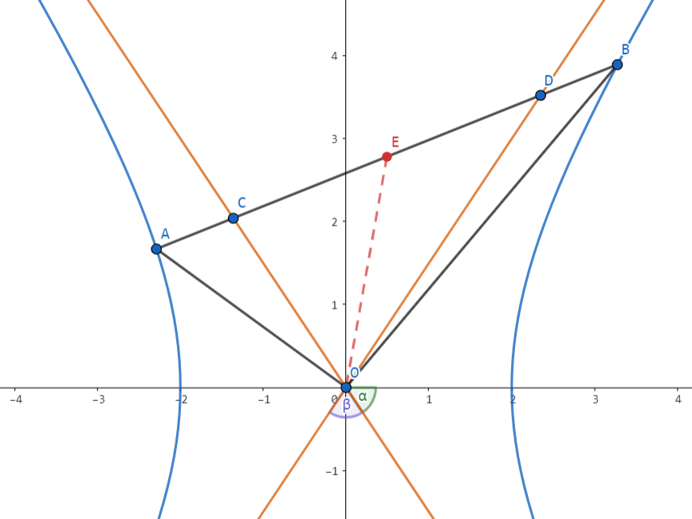

设 $CD$ 中点为 $E$，渐近线与 $x$ 轴的夹角为 $\alpha$，$\angle COD=\beta$（$2\alpha+\beta=\pi$），则 $O$ 在以 $AB$ 为直径的圆上。

我们剥离双曲线，单看 $A,C,D,B$ 这个结构：

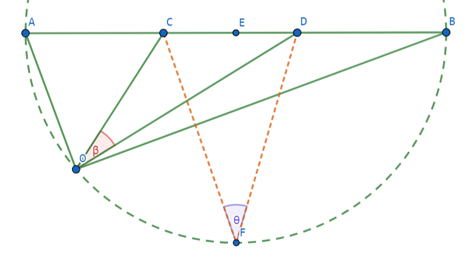

点 $F$ 满足 $EF\bot AB$，由圆外角 $<$ 圆周角知 $\beta\le \theta< \frac{\pi}{2}$，因此：

$$
\begin{aligned}
&&\pi-2\alpha&\le \theta\\
&\Rightarrow&\frac{\pi}{2}-\frac{\theta}{2}&\le \alpha\\
&\Rightarrow&3=\cot \frac{\theta}{2}&\le \tan \alpha
\end{aligned}
$$

回到双曲线本身，$\tan\alpha=\frac{b}{a}\ge 3\Rightarrow e\in [\sqrt{10},+\infty)$，选 $\boxed{\mathrm{D}}$。

**反思**

$[1]$ 双曲线与其渐近线间有许多优美的性质，本质在于它们的方程为 $\frac{x^2}{a^2}-\frac{y^2}{b^2}=0/1$，只有常数项不同，故不影响 $x_1+x_2$ 的值。下面这些结论定性记忆，考场代特殊位置还原具体数值即可。

设 $P$ 在双曲线 $C$ 上，则

- $P$ 到两渐近线距离之积为定值 $\frac{a^2b^2}{c^2}$；
- 过 $P$ 作两渐近线的平行线，与两渐近线围成的平行四边形面积为定值 $\frac{ab}{2}$；
- 过 $P$ 作 $C$ 的切线，则 $P$ 为所截线段中点；
- 过 $P$ 作 $C$ 的切线，与渐近线围成的三角形面积为定值 $ab$。

$[2]$ 遇到圆锥曲线的题，我们似乎很容易局限于"以圆锥曲线为母体"的思维定势中，但这不是绝对的。像此题，固定这条直线，去求符合要求的双曲线的 $\alpha$ 限制，会更加便捷。

---

!!! problem "2023.02 LHB，2（新视角：光学性质，圆）"
    已知 $F_1,F_2$ 是椭圆 $\frac{x^2}{9}+\frac{y^2}{5}=1$ 的左右焦点，若直线 $l$ 是椭圆的一条切线，若点 $F_1,F_2$ 到直线 $l$ 的距离分别为 $d_1,d_2$，则有（　　）

    A. $d_1+d_2=9$

    B. $d_1d_2=5$

    C. $2\sqrt{5}\le d_1+d_2\le 6$

    D. $\frac{1}{5}\le \frac{d_1}{d_2}\le 5$

**解答**

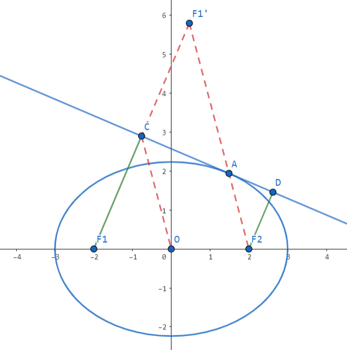

作 $F_1$ 关于切线的对称点 $F_1'$，由椭圆的光学性质知 $F_1',A,F_2$ 三点共线。

由椭圆的第一性质知 $|F_1'F_2|=2a$，由 $|CO|$ 是 $\triangle \mathrm{F_1F_1'F_2}$ 的中位线 $\Rightarrow |CO|=a$。因此 $C,D$ 在以 $O$ 为圆心，半径为 $a$ 的圆上。

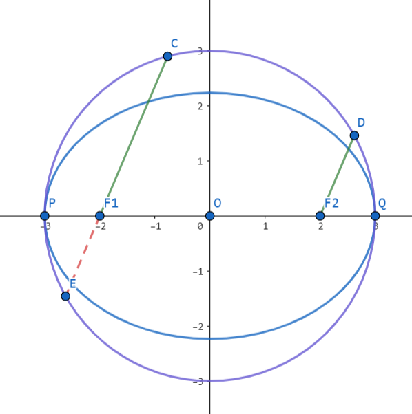

我们将不必要的线条抹去，延长 $CF_1$ 至 $E$，由于 $CF_1\parallel DF_2$，由对称性知 $|F_1E|=|DF_2|$。

由相交弦定理知 $d_1d_2=|F_1P||F_1Q|=(a-c)(a+c)=5$，因此 $B$ 正确。

又 $|CF_1|\ge |CO|-|OF_1|=1$，因此 $d_1+d_2\in [2\sqrt{5},6]$，$\frac{d_1}{d_2}\in [\frac{1}{5},5]$，因此 $CD$ 正确。

综上，选 $\boxed{\mathrm{BCD}}$。

---

!!! problem "2023.02 G12 名校协作体，22（新视角：焦半径单刀直入）"
    已知椭圆 $C:\frac{x^2}{4}+\frac{y^2}{3}=1$，$F_1,F_2$ 为椭圆 $C$ 的左右焦点，$Q(x_0,y_0)$ 为平面内一个动点，其中 $y_0>0$，记直线 $QF_1$ 与椭圆 $C$ 在 $x$ 轴上方的交点为 $A(x_1,y_1)$，直线 $QF_2$ 与椭圆 $C$ 在 $x$ 轴上方的交点为 $B(x_2,y_2)$。

    若 $|QF_1|+|QF_2|=3$，探究 $y_0,y_1,y_2$ 之间关系。

**方法一：角度式焦半径 + 新椭圆**

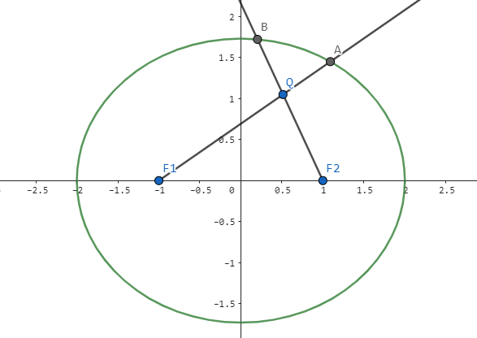

显然 $\mathrm{Q}$ 在 $\frac{x^2}{\frac{9}{4}}+\frac{y^2}{\frac{5}{4}}=1$ 上，两椭圆共焦点，用角度式焦半径。

设 $\angle \mathrm{AF_1F_2}=\alpha,\angle \mathrm{BF_2F_1}=\theta$，则 $\begin{cases}
|QF_1|= \frac{\frac 54}{\frac 32-\cos \alpha}\\
|AF_1|= \frac{3}{2-\cos \alpha}\\
|QF_2|= \frac{\frac 54}{\frac 32-\cos \theta}\\
|BF_2|= \frac{3}{2-\cos \theta}\\
\end{cases}$。

由于 $|QF_1|+|QF_2|=3$，故

$$
\begin{aligned}
\frac{y_0}{y_1}+\frac{y_0}{y_2}&=\frac{|QF_1|}{|AF_1|}+\frac{|QF_2|}{|BF_2|}\\
&=\frac{5}{12}\left(\frac{2-\cos \alpha}{\frac 32-\cos \alpha}+\frac{2-\cos \theta}{\frac 32-\cos \theta}\right) \\
&=\frac{5}{12}\left(2+\frac{\frac 12}{\frac 32-\cos \alpha}+\frac{\frac 12}{\frac 32-\cos \theta}\right)\\
&=\frac{4}{3}
\end{aligned}
$$

因此 $\boxed{\frac{1}{y_1}+\frac{1}{y_2}=\frac{4}{3}\cdot \frac{1}{y_0}}$。

**方法二：焦半径**

由焦半径知 $\begin{cases}|F_1A|=2+\frac{x_1}{2} \\ |F_2B|=2-\frac{x_2}{2}\end{cases}$，因此 $\begin{cases}|F_1Q|=\frac{y_0}{y_1}(2+\frac{x_1}{2}) \\ |F_2Q|=\frac{y_0}{y_2}(2-\frac{x_2}{2})\end{cases}$。

注意到

$$
\begin{aligned}
|F_1Q|+|F_2Q|&=\frac{y_0}{y_1}(2+\frac{\frac{y_1}{y_0}(x_0+1)-1}{2})+\frac{y_0}{y_2}(2-\frac{\frac{y_2}{y_0}(x_0-1)+1}{2})\\
&=\frac{3}{2}\left(\frac{y_0}{y_1}+\frac{y_0}{y_2}\right)+1
\end{aligned}
$$

因此 $\frac{y_0}{y_1}+\frac{y_0}{y_2}=\frac{4}{3}\Rightarrow \boxed{\frac{1}{y_1}+\frac{1}{y_2}=\frac{4}{3}\cdot \frac{1}{y_0}}$。

**反思**

$[1]$ 一开始我只想到角度式焦半径的做法，可能是思路被"新椭圆"框死了。清醒时回头一想，发现直接焦半径就可以秒杀，非常精彩！

---

!!! problem "2023.02 浙南七彩，21（高观点：第二定义，相似）"
    已知点 $\mathrm{F}$ 为双曲线 $\tau:\frac{x^2}{4}-\frac{y^2}{12}=1$ 的右焦点，过 $\mathrm{F}$ 的任一直线 $l$ 交 $\tau$ 于 $\mathrm{A,B}$ 两点，直线 $l_1:x=1$。

    （2）若 $\mathrm{M}(-4,6)$ 为曲线 $\tau$ 上一点，直线 $\mathrm{MA,MB}$ 分别与直线 $l_1$ 交于 $\mathrm{D,E}$ 两点，问以线段 $\mathrm{DE}$ 为直径的圆是否过定点？若是，求出定点坐标；若不是，请说明理由。

**溯源：第二定义+相似**

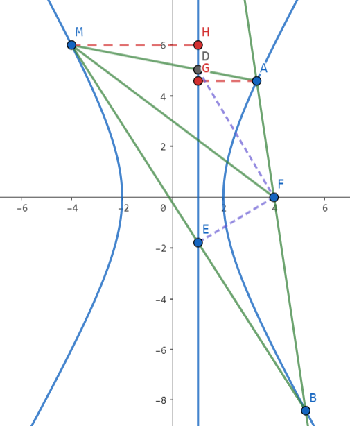

$\triangleright^{[1]}$ 对于任意在 $\tau$ 上的点 $\mathrm{M}$，均满足 $FD\bot FE$。

直线 $l_1$ 是双曲线的右准线，由双曲线的第二定义，$\mathrm{\frac{|MF|}{|MH|}=\frac{|AF|}{|AG|}=e\Rightarrow \frac{|FM|}{|FA|}=\frac{|MH|}{|AG|}}$。

显然 $\triangle \mathrm{DHM}\sim \triangle \mathrm{DGA}$，因此 $\mathrm{\frac{|MH|}{|AG|}=\frac{|DM|}{|DA|}}$。

因此 $\mathrm{\frac{|FM|}{|FA|}=\frac{|DM|}{|DA|}\Rightarrow FD}$ 平分 $\mathrm{\angle MFA}\Rightarrow \angle \mathrm{DFE}=\frac{\pi}{2}$。由对称性知 $(-2,0),(4,0)$ 均为所求定点。

**反思**

$[1]$：考场上如果不知道这个结论会很被动。首先得猜到定点在 $x$ 轴上，然后代 $l$ 垂直 $x$ 轴的特殊情形把定点猜出来，然后再针对性证明应该是最好的策略。

---

!!! problem "2023.04 长沙一中月考，22（高观点：阿氏圆）"
    设椭圆 $\mathrm{C}: \frac{x^2}{8}+\frac{y^2}{6}=1$，焦点为 $\mathrm{F_1,F_2}$，过 $\mathrm{F_2}$ 作斜率为 $k\ (k>0)$ 的直线 $m$ 与椭圆 $\mathrm{C}$ 相交于 $\mathrm{A,B}$ 两点（点 $\mathrm{A}$ 在 $x$ 轴上方）。点 $\mathrm{M,N}$ 是椭圆上异于 $\mathrm{A,B}$ 的两点，$\mathrm{MF_2,NF_2}$ 分别平分 $\angle \mathrm{AMB},\angle \mathrm{ANB}$，若 $\triangle\mathrm{MF_2N}$ 外接圆的面积为 $\frac{81}{8}\pi$，求直线 $m$ 的方程。

**解答**

由 $\mathrm{MF_2,NF_2}$ 是角平分线知 $\mathrm{\frac{|MA|}{|MB|}=\frac{|NA|}{|NB|}=\frac{|AF_2|}{|F_2B|}}$，因此 **$\mathrm{M,F_2,N}$ 均在以 $\mathrm{A,B}$ 为定点，两边比为 $\mathrm{\frac{|AF_2|}{|F_2B|}}$ 的阿氏圆上**。

由 $\triangle \mathrm{MF_2N}$ 外接圆面积为 $\frac{81}{8}\pi$ 知 $R=\frac{9}{2\sqrt{2}}$，则 $\mathrm{\frac{|F_2A|}{|F_2B|}=\frac{2R-|F_2A|}{2R+|F_2B|}}$，解得 $\frac{1}{|F_2A|}-\frac{1}{|F_2B|}=\frac{1}{R}=\frac{2\sqrt{2}}{9}$。

设 $\angle \mathrm{AF_2C}=\theta$，则 $|F_2A|=\frac{b^2}{a+c\cos \theta},|F_2B|=\frac{b^2}{a-c\cos \theta}$，因此 $\frac{2c\cos \theta}{b^2}=\frac{2\sqrt{2}}{9}$，即 $\cos \theta =\frac{2}{3}$。

因此直线 $m$ 的方程为 $y=\frac{\sqrt{5}}{2}x-\frac{\sqrt{10}}{2}$。

---

!!! problem "2023.11 绍兴一模，22（高观点：极点极线，调和点列，阿氏圆）"
    已知双曲线 $\Gamma: x^2-y^2=1$，过点 $\mathrm{M}(1,-1)$ 的直线 $l$ 与该双曲线的左、右两支分别交于点 $\mathrm{A,B}$。求定点 $\mathrm{P}(t,t-2)\ (t\neq 1)$，使得 $\angle \mathrm{MPA}=\angle \mathrm{MPB}$。

**溯源：极点极线+调和点列+阿氏圆**

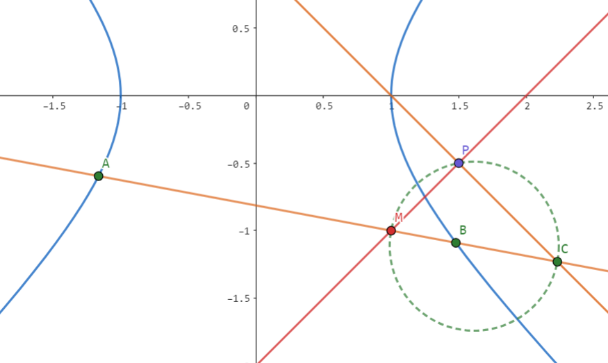

$\angle \mathrm{MPA}=\angle \mathrm{MPB}$ 即 $\mathrm{PM}$ 为 $\angle \mathrm{APB}$ 的角平分线，由角平分线定理知 $\mathrm{\frac{|PA|}{|PB|}=\frac{|AM|}{|MB|}}$。

结构酷似调和点列，作 $\mathrm{M}$ 关于 $\Gamma$ 的极线 $l_1: x+y=1$，交直线 $l$ 于 $\mathrm{C}$，则 $\mathrm{(A,B;M,C)}$ 为调和点列。

于是 $\mathrm{\frac{|AM|}{|MB|}}=\mathrm{\frac{|AC|}{|CB|}}$，因此 **$\mathrm{P}$ 在以 $\mathrm{MC}$ 为直径的阿氏圆上**，故 $\angle \mathrm{MPC}=\frac{\pi}{2}$。

又 $\mathrm{P}(t,t-2)$ 在 $l_2: y=x-2$ 上，且 $l_1$ 过 $\mathrm{C}$，$l_2$ 过 $\mathrm{M}$，$l_1\bot l_2$，因此 $\mathrm{P}$ 为 $l_1$ 与 $l_2$ 的交点，即 $\mathrm{P}(\frac{3}{2},-\frac{1}{2})$。

**量产** 只需要构造 $l_2$ 过 $\mathrm{M}$ 且垂直于 $\mathrm{M}$ 的极线 $l_1$ 即可，$l_1$ 与 $l_2$ 的交点即为定点 $\mathrm{P}$。

**解答 1：向量法（重思维，计算量小）**

注意到 $\angle \mathrm{APB}<\pi$，因此 **$\angle \mathrm{MPA}=\angle \mathrm{MPB}$ 等价于 $\cos \angle \mathrm{MPA}=\cos \angle \mathrm{MPB}$**，于是有：

$$
\begin{aligned}
\frac{\vec{PA}\cdot \vec{PM}}{|PA|}&=\frac{\vec{PB}\cdot \vec{PM}}{|PB|}\\
\frac{x_A+y_A-2t+2}{1-x_A}&=\frac{x_B+y_B-2t+2}{x_B-1}
\end{aligned}
$$

联立韦达，解得 $t=\frac{3}{2}$，于是 $\mathrm{P}(\frac{3}{2},-\frac{1}{2})$。

**解答 2：到角公式**

设 $\mathrm{AP}$ 的斜率为 $k_1$，$\mathrm{BP}$ 的斜率为 $k_2$，**注意到 $\mathrm{MP}$ 的斜率为 $1$**，则 $\begin{cases}\tan\angle \mathrm{MPA}=\frac{1-k_1}{1+k_1} \\ \tan \angle\mathrm{MPB}=\frac{k_2-1}{1+k_2}\end{cases}$，因此 $k_1k_2=1$。

因此 $\frac{t-2-y_A}{t-x_A}\cdot \frac{t-2-y_B}{t-x_B}=1$，联立韦达，解得 $t=2$。

---

!!! problem "2024.03 T8，18（命题背景：曲线系，极点极线）"
    已知双曲线 $\tau: \frac{x^2}{4}-y^2=1$，$\mathrm{B}\ (-a, 0), \mathrm{C}\ (a,0)$，其中 $a>2$，$\mathrm{D}\ (x_0,y_0)\ (x_0\ge a,y_0>0)$ 是双曲线上一点，直线 $\mathrm{DB}$ 与双曲线 $\tau$ 的另一个交点为 $\mathrm{E}$，直线 $\mathrm{DC}$ 与双曲线 $\tau$ 的另一个交点为 $\mathrm{F}$，双曲线 $\tau$ 在 $\mathrm{E,F}$ 处的两条切线记为 $l_1,l_2$，$l_1$ 与 $l_2$ 交于点 $\mathrm{P}$，线段 $\mathrm{DP}$ 的中点为 $\mathrm{G}$。

    **(2)** 求 $\mathrm{\frac{|GB|}{|GC|}}$ 的值。

**曲线系 + 极点极线**

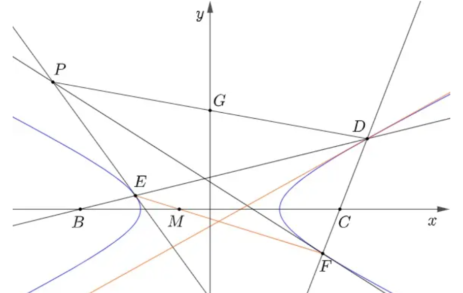

$\textbf{Lemma.}$ 对于二次曲线 $ax^2+by^2=1$ 上的四边形 $\mathrm{A_1A_2A_3A_4}$，记 $A_iA_{i+1}$ 所在直线方程为 $y=k_ix+m_i$，则有 $(k_1+k_3)(m_2+m_4)=(k_2+k_4)(m_1+m_3)$。

$\textbf{Proof.}$ 考虑曲线系 $(y-k_1x-m_1)(y-k_3x-m_3)+\lambda (y-k_2x-m_2)(y-k_4x-m_4)=ax^2+by^2-1$，对比 $[xy], [y]$ 项前系数即可。

考虑四边形 $\mathrm{DDFE}$，$\mathrm{DE}$ 与 $\mathrm{DF}$ 在 $x$ 轴上的截距为相反数，故 $\mathrm{DD}$ 与 $\mathrm{EF}$ 在 $x$ 轴上的截距也为相反数。

又 $\mathrm{DD}:\ \frac{x_0x}{4}-y_0y=1$ 过 $(\frac{4}{x_0},0)$，故 $\mathrm{EF}$ 过 $(-\frac{4}{x_0},0)$。

而 $\mathrm{EF}$ 为 $\mathrm{P}$ 的极线，由配极原理知 $\mathrm{P}$ 在 $\mathrm{M}$ 的极线上，故 $x_P=-x_0$。

**优化解答：齐次化**

设 $\mathrm{EF}: m(x-x_0)+n(y-y_0)=1$，注意到 $\frac{1}{k_{DE}}+\frac{1}{k_{DF}}=\frac{2x_0}{y_0}$，联立得

$$
\left(\frac{1}{4}+\frac{mx_0}{2}\right)\left(\frac 1k\right)^2+\left(\frac{nx_0}{2}-2my_0\right)\left(\frac 1k\right)-\left(1+2ny_0\right)=0
$$

由韦达得 $m(-\frac{4}{x_0}-x_0)-ny_0=1$，因此 $\mathrm{EF}$ 过 $(-\frac{4}{x_0},0)$。

设 $\mathrm{P}(x_1,y_1)$，则 $\mathrm{EF}:\ \frac{x_1x}{4}-y_1y=1$，故 $x_1=-x_0$，因此 $\mathrm{\frac{|GB|}{|GC|}=1}$。
